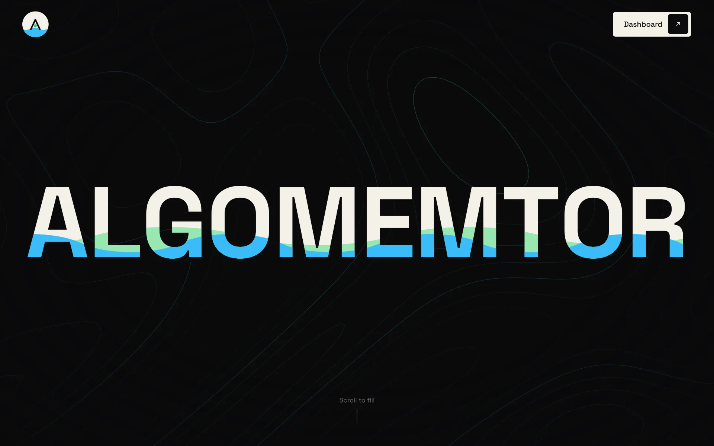
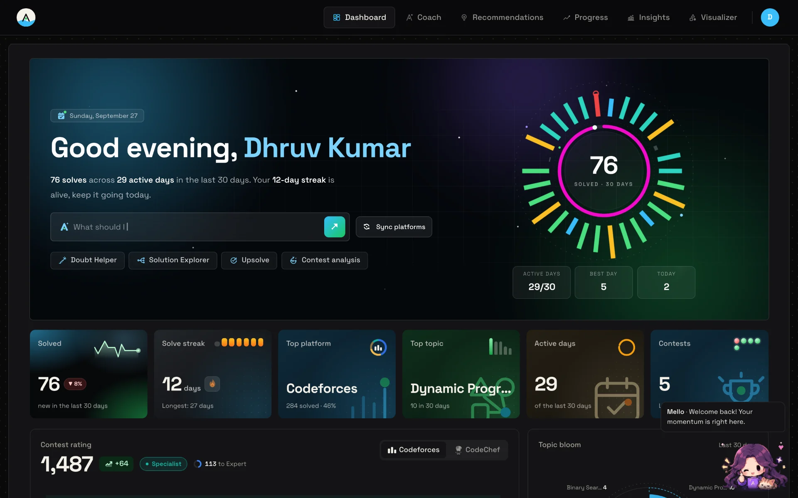
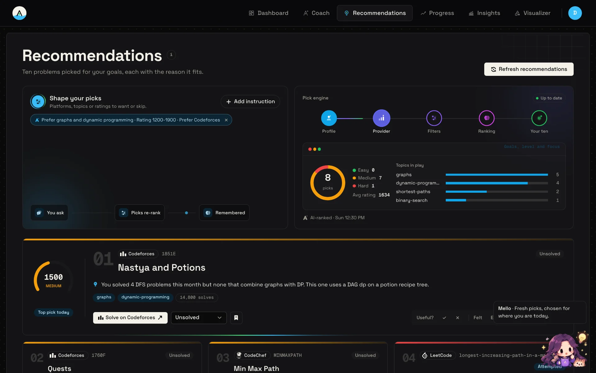
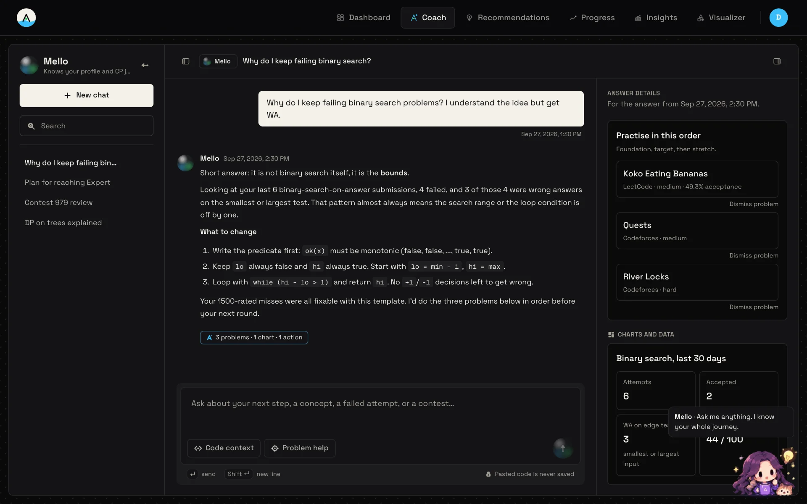
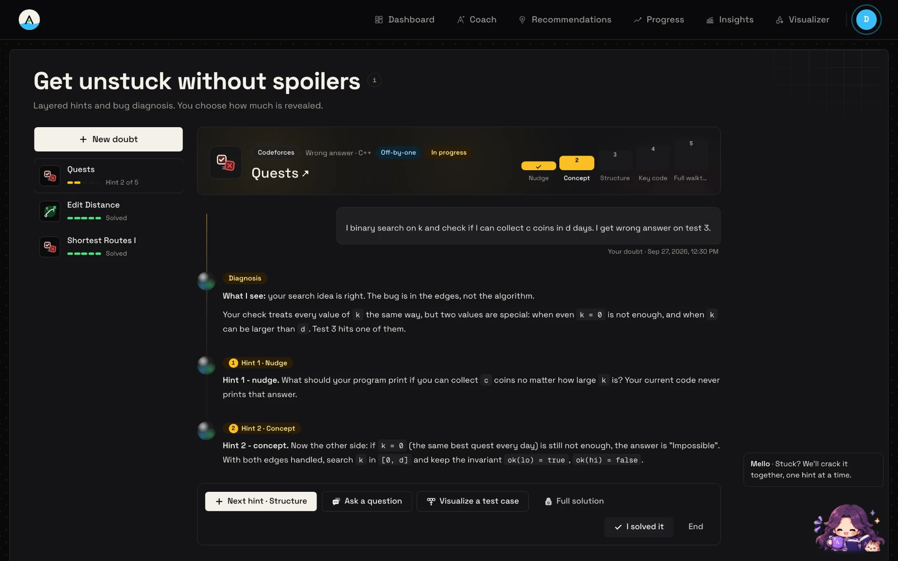
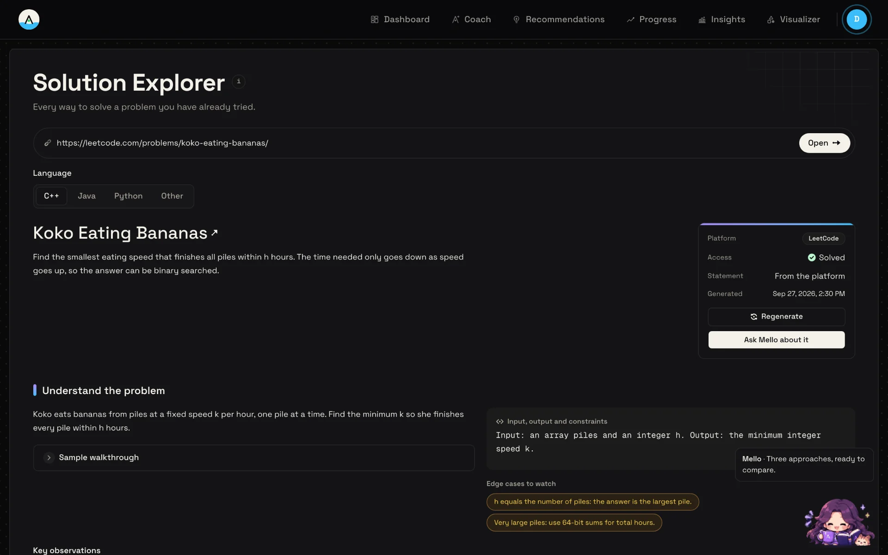
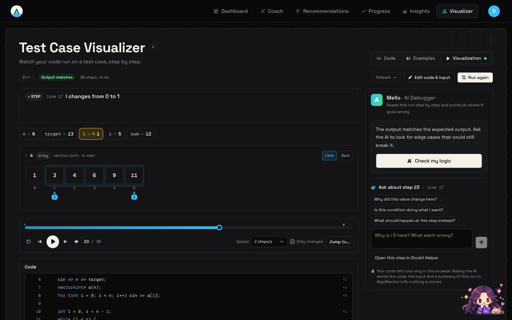
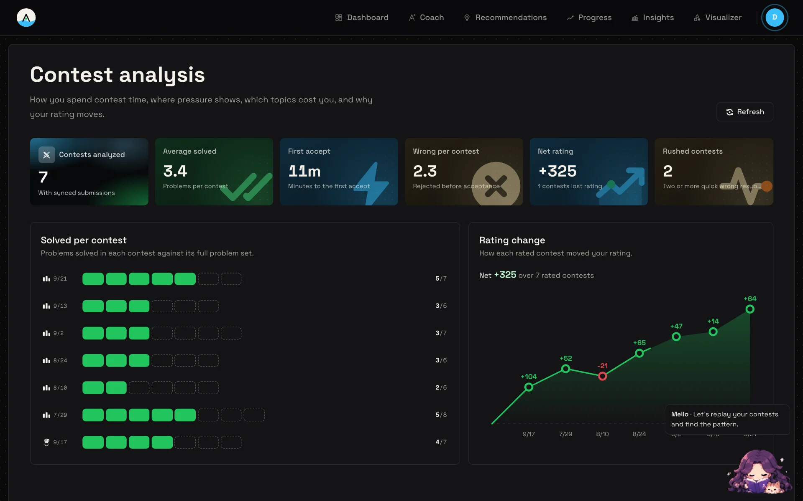
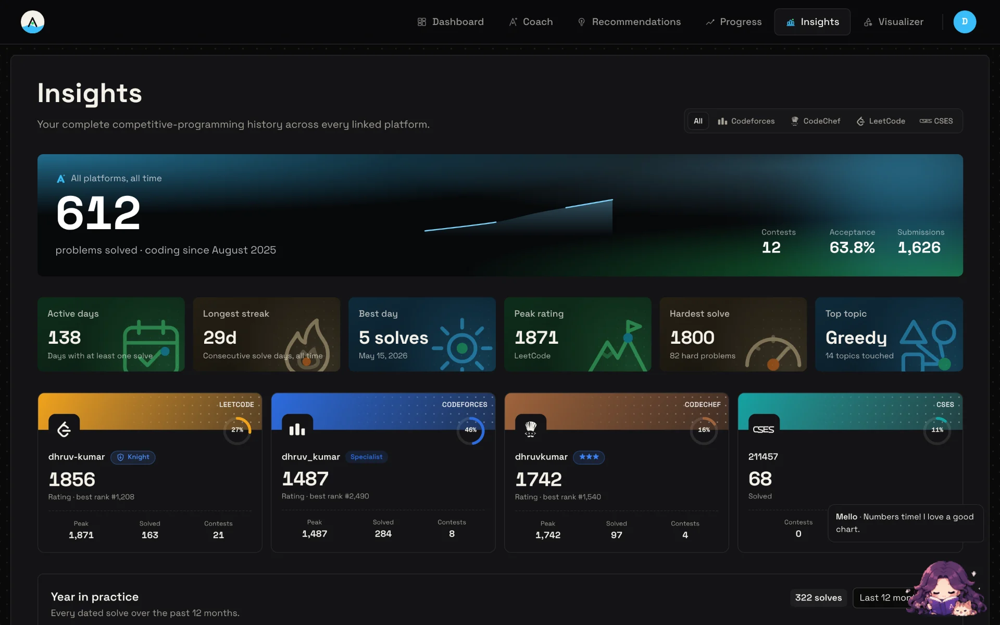
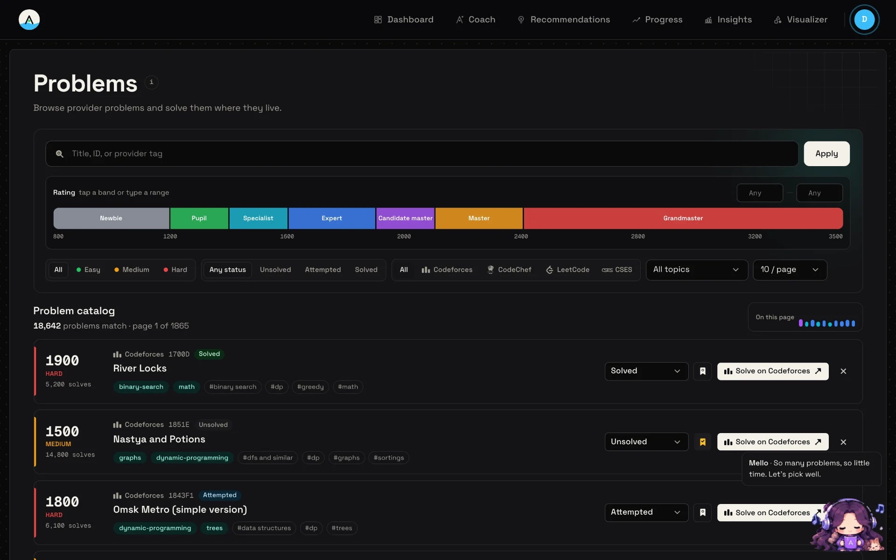

# AlgoMemtor

**Stop guessing what to practice next.**

Your personal AI mentor for competitive programming.

[**Try it at algomemtor.site**](https://algomemtor.site)

---

<video src="https://github.com/user-attachments/assets/00234fa6-ee54-459a-9eb1-3c5f1fb9db72" controls="controls" width="100%"></video>
 
A 2.5-minute tour: your dashboard, AI recommendations, the coach, Mello the pet companion, the Doubt Helper, the Test Case Visualizer and AI Debugger, and more.

## What is AlgoMemtor?

You've solved hundreds of problems across Codeforces, LeetCode and CodeChef, but you still don't know what to solve next. Your progress is scattered across different websites, and random practice doesn't fix your weak spots.

AlgoMemtor brings it all together. Connect your accounts once, and it looks at everything you've solved, where you get stuck, and how your contests go. Then it tells you exactly what to practice next, and why.

You still solve every problem on the original website. AlgoMemtor just makes sure you're solving the right ones.

## What you can do

- **See all your progress in one place** - Your solves, ratings, streaks and contests from Codeforces, CodeChef, LeetCode and CSES on a single dashboard.
- **Get problems picked for you** - A daily list of problems matched to your level, each with a short reason like *"You've struggled with binary search on answers - this one builds on that."* Want something different? Just type *"more graph problems, nothing too hard"*.
- **Chat with your coach** - Ask anything: *"Why do I keep failing DP problems?"* or *"Am I ready for Div 2 C?"*. The coach knows your actual history and answers based on it, not generic advice.
- **Practise with a companion** - Meet **Mello**, your coach in pet form. Mello follows you around the app, reacts to what you're doing, and answers questions about whatever page you're on in one click. Prefer someone else? Switch to Kai or Luna any time.
- **Follow a roadmap made for you** - See which topics you're strong in, which need work, and which you should revisit. Each topic comes with easy, medium and stretch problems.
- **Get unstuck without spoilers** - The **Doubt Helper** gives you hints one step at a time, so you still get the satisfaction of solving it yourself.
- **Understand solutions properly** - The **Solution Explorer** walks you from the brute-force idea to the optimal one, explaining each step.
- **Watch your code run** - The **Test Case Visualizer** runs your C++, Java or Python code on your own input and shows arrays, trees and heaps changing step by step. If your answer is wrong, the AI Debugger shows you exactly where it went off track.
- **Learn from every contest** - **Contest Analysis** shows where your time went, and the **Upsolve Tracker** lines up the problems you missed so you actually go back to them.
- **Track your growth** - Charts for your rating, topics, difficulty and activity, plus a written **Progress Report** on how you're improving.

## Screenshots

|                                                                                                         |                                                                                                        |
| :-----------------------------------------------------------------------------------------------------: | :----------------------------------------------------------------------------------------------------: |
|        Home page                   |       Your dashboard            |
|  Problems picked for you   |     Chatting with your coach       |
|     Doubt Helper hints         |    Solution Explorer           |
|    Test Case Visualizer         |  Contest Analysis       |
|       Progress and insights       |       Every problem in one place |

---

## How it works

1. **Sign up** with email or Google.
2. **Tell us your goal** - interview prep, a Codeforces rating target, or just getting better.
3. **Connect your accounts** - Add your Codeforces or CodeChef handle. For LeetCode and CSES, install the small AlgoMemtor browser extension (Chrome or Firefox) and it syncs your history automatically.
4. **Get your plan** - Your dashboard, roadmap and recommendations fill in within a few minutes.
5. **Practice** - Click a problem, solve it on the original website, and AlgoMemtor picks up your progress on its own.

**Supported platforms:** Codeforces, CodeChef, LeetCode, CSES

**Visualizer languages:** C++, Java, Python

---

## Your data, your control

- **We never see your passwords.** Accounts are linked by handle, or synced through your own browser.
- **We never store your code.** Code you paste into the Doubt Helper or Visualizer is used for that one request and then thrown away. The Visualizer runs entirely on your own computer.
- **The coach's memory is visible to you.** Open the Memory page to see what the coach remembers about you, and correct or delete anything.
- **Delete everything anytime.** One button in Settings removes all of your data.
- **AI suggestions never change things on their own.** If the coach suggests updating your roadmap or saving a problem, nothing happens until you confirm it.

---

## FAQ

**Is it free?**
Yes. There are daily limits on AI features (coach chats, mentor tools, recommendation refreshes) to keep it free for everyone. Browsing, tracking and your dashboard have no limits.

**Does AlgoMemtor host problems?**
No. Every problem opens on its original website. AlgoMemtor only recommends, explains and tracks.

**Do I need the browser extension?**
Only for LeetCode and CSES history. Codeforces and CodeChef work with just your handle.

**What if the AI is down?**
Your dashboard, problem list, roadmap and recommendations keep working. Only chat-style features pause until it's back.

---

Built by **Dhruv Kumar**

