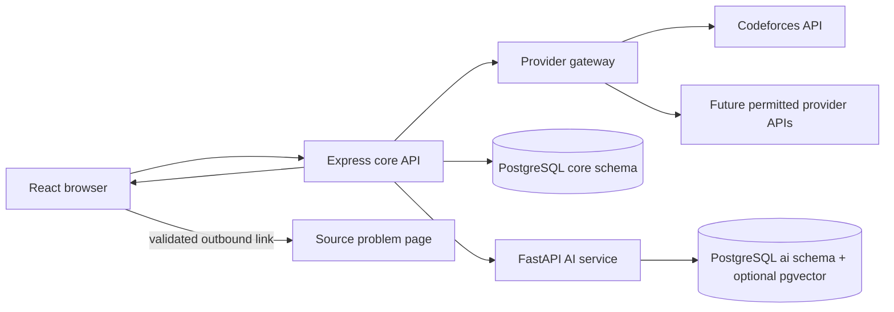

# AlgoMemtor Project Documentation

## External Problem Discovery and AI Recommendation Architecture

This is the detailed product and engineering reference for AlgoMemtor. It is
written for a beginner-friendly implementation while keeping production
boundaries explicit.

> **Architecture change:** AlgoMemtor no longer plans to host problem statements,
> examples, constraints, starter code, test cases, a Monaco editor, or code
> execution. Its contracts and development mocks now use permitted external
> metadata, and future features recommend problems before redirecting learners to
> the original platform.

---

## Table of Contents

1. [How to use this document](#1-how-to-use-this-document)
2. [Product overview](#2-product-overview)
3. [MVP scope](#3-mvp-scope)
4. [Important concepts](#4-important-concepts)
5. [Technology stack](#5-technology-stack)
6. [System architecture](#6-system-architecture)
7. [Repository and local development](#7-repository-and-local-development)
8. [Frontend architecture](#8-frontend-architecture)
9. [Screens and user experience](#9-screens-and-user-experience)
10. [External provider gateway](#10-external-provider-gateway)
11. [Core API](#11-core-api)
12. [AI recommendation service](#12-ai-recommendation-service)
13. [Authentication and provider linking](#13-authentication-and-provider-linking)
14. [Database design](#14-database-design)
15. [Progress evidence](#15-progress-evidence)
16. [API standards](#16-api-standards)
17. [Mock-first development](#17-mock-first-development)
18. [Testing](#18-testing)
19. [Security, privacy, and provider compliance](#19-security-privacy-and-provider-compliance)
20. [Logging and observability](#20-logging-and-observability)
21. [Deployment](#21-deployment)
22. [Git and coding conventions](#22-git-and-coding-conventions)
23. [Definition of done](#23-definition-of-done)
24. [Common mistakes](#24-common-mistakes)
25. [Troubleshooting](#25-troubleshooting)
26. [Glossary and references](#26-glossary-and-references)

---

# 1. How to Use This Document

Use this document to answer four questions:

1. What should AlgoMemtor do?
2. Which service owns each responsibility?
3. What data is allowed to enter the system?
4. How do we verify a feature safely?

When implementation and documentation disagree, do not silently bend the new
architecture around old code. Record the mismatch and migrate it in a focused
change.

Project rules:

- Build one end-to-end slice at a time.
- Keep provider access deterministic and outside the browser.
- Let AI rank only backend-supplied candidates.
- Store metadata and learner evidence, not copied problem content.
- Treat all external data and AI output as untrusted.
- Do not infer learning progress from external-link clicks.
- Keep the product usable if AI or one provider is unavailable.
- Do not push branches or commits unless explicitly requested.

---

# 2. Product Overview

## 2.1 What AlgoMemtor is

AlgoMemtor is an AI-assisted learning navigator for:

- Data Structures and Algorithms;
- competitive programming;
- coding interview preparation; and
- long-term algorithmic learning.

It builds a learner profile, obtains external problem metadata through approved
provider integrations, recommends suitable problems, and opens the canonical
problem page on the source platform.

## 2.2 What AlgoMemtor is not

AlgoMemtor is not:

- a mirror of LeetCode, Codeforces, CodeChef, AtCoder, CSES, or another provider;
- a storage system for external statements or test cases;
- an online IDE;
- a compiler or judge;
- a submission proxy; or
- a scraper for platforms without a permitted API.

## 2.3 Core product loop

```text
Onboard learner
  -> fetch normalized external metadata
  -> filter safe candidates
  -> AI ranks candidates
  -> explain recommendations
  -> learner opens the source platform
  -> collect manual or provider-verified evidence
  -> update learner profile
  -> improve the next recommendation
```

## 2.4 Product principles

- **Source-first:** the provider remains visible and authoritative.
- **Recommendation-first:** explain why a problem fits.
- **Evidence-first:** confidence must match the available signal.
- **API-first:** integrate only through official or explicitly permitted access.
- **Fallback-first:** ordinary filtering works without AI.
- **Privacy-first:** collect the minimum activity needed for personalization.

---

# 3. MVP Scope

## 3.1 Included

### Account and onboarding

- Email registration and login.
- Goal, experience, preferred topics, and weekly target.
- Preferred providers and difficulty range.
- Optional public handle or provider authorization with consent.

### Problem discovery

- Metadata from at least one approved provider API.
- Provider attribution and canonical outbound URL.
- Search, provider, topic, difficulty, and status filters.
- Bookmarks and dismissed recommendations.
- Loading, empty, stale, partial, rate-limited, and error states.

### AI recommendations

- Natural-language preference input.
- Structured candidate filtering.
- AI ranking of validated candidates.
- Short explanation for every recommendation.
- Deterministic fallback when AI fails.

### Progress

- Recommendation history.
- Question status limited to `unsolved`, `attempted`, and `solved`.
- Provider-verified solves only when a supported API makes this reliable.
- Explicit labels for every evidence type.

## 3.2 Excluded

- Internal problem content.
- Embedded editor or code execution.
- Draft and source-code storage.
- Internal submissions or verdicts.
- Hidden test cases.
- HTML scraping and unofficial private endpoints.
- Recreated contests or platform judges.
- Automatic verification based only on a click.
- Payments, marketplaces, duels, and complex multi-agent orchestration.

## 3.3 MVP success criteria

The MVP succeeds when a learner can:

1. finish onboarding;
2. request a relevant practice problem;
3. understand why it was suggested;
4. open the correct source-platform URL;
5. record what happened afterward; and
6. receive a measurably better next recommendation.

---

# 4. Important Concepts

## 4.1 Frontend

The React application renders screens and sends requests to AlgoMemtor APIs. It
does not fetch providers directly because provider normalization, credentials,
rate limits, cache policy, and URL validation belong on the server.

## 4.2 Backend

The backend contains two services:

- Express owns product logic and provider integrations.
- FastAPI owns AI ranking and learner intelligence.

## 4.3 Provider adapter

A provider adapter translates one external API into AlgoMemtor's normalized
contract. React should not need to know that one provider calls difficulty a
`rating` while another uses a label.

## 4.4 Metadata versus content

Metadata helps identify and select a problem:

- provider;
- external ID;
- title;
- rating/difficulty;
- tags;
- public statistics; and
- canonical URL.

Content is what a learner needs to solve it:

- full statement;
- input/output specification;
- examples and constraints;
- starter code;
- tests; and
- editorial.

AlgoMemtor may cache permitted metadata. The source platform retains content.

## 4.5 Redirect and outbound link

The word “redirect” in this project means navigating to a validated external
problem URL. A problem card may use a direct anchor or a first-party endpoint
that records an event and then issues a `302/303` redirect.

Any redirect endpoint must map a known `(provider, externalId)` to a server-owned
canonical URL. It must never accept and forward an arbitrary user URL.

## 4.6 AI ranking

The AI receives a bounded candidate list and learner context. It returns selected
candidate IDs, scores, and reasons. Express validates that every returned ID was
in the candidate list, then attaches trusted URLs from its own data.

## 4.7 Evidence

Evidence describes how AlgoMemtor knows something. Manual completion and a
provider-verified solve are different facts and must remain different in the
data model and UI. Following an external link is not progress evidence.

## 4.8 Cache

A cache temporarily reuses provider metadata to improve speed and stay within
rate limits. Caching does not transfer ownership of provider data to AlgoMemtor.

---

# 5. Technology Stack

| Layer          | Technology              | Purpose                                              |
| -------------- | ----------------------- | ---------------------------------------------------- |
| Web            | React, Vite, TypeScript | Accessible catalog and recommendation UI             |
| Routing        | React Router            | Client-side route mapping                            |
| Server state   | TanStack Query          | API loading, cache, retry, and stale states          |
| Mock API       | MSW                     | Frontend-first provider and recommendation scenarios |
| Validation     | Zod                     | Browser and Express TypeScript contracts             |
| Core API       | Express + TypeScript    | Product behavior and provider gateway                |
| AI API         | FastAPI + Python        | Ranking, explanations, memory                        |
| AI validation  | Pydantic                | Internal request/response schemas                    |
| Database       | PostgreSQL              | Learner data and permitted metadata cache            |
| Vector support | pgvector                | Optional learner-memory retrieval                    |
| Authentication | Supabase Auth           | Managed user identity                                |

There is no Monaco or Judge0 dependency in the target architecture.

---

# 6. System Architecture



## 6.1 Discovery request

```text
React
  -> GET /api/problems?provider=codeforces&topic=graphs
  -> Express validates query
  -> provider gateway checks cache
  -> adapter fetches/normalizes if needed
  -> Express returns metadata-only results
```

## 6.2 Recommendation request

```text
React
  -> POST /api/recommendations
  -> Express loads profile and candidate metadata
  -> deterministic filters remove unsuitable candidates
  -> FastAPI ranks candidate IDs and writes reasons
  -> Express validates AI output and attaches canonical URLs
  -> React renders attributed cards
```

## 6.3 Outbound navigation

```text
Learner selects Solve on Codeforces
  -> server resolves known provider + external ID
  -> learner navigates to the canonical provider URL
```

The external site handles statement display, editing, compilation, submission,
and judging.

## 6.4 Failure boundaries

- If AI fails, use deterministic ranking.
- If one provider fails, return partial results from others.
- If cached metadata is still allowed but stale, show a stale label.
- If no provider is available, show bookmarks and a retry state.
- Provider failure must not corrupt learner progress.

---

# 7. Repository and Local Development

## 7.1 Repository structure

```text
apps/
  web/                    React frontend
  core-api/               Express API and provider adapters
  ai-api/                 FastAPI ranking and memory
packages/
  shared-contracts/       Shared Zod schemas and TypeScript types
docs/                     Product, architecture, and roadmap documents
```

Recommended future core API layout:

```text
apps/core-api/src/
  controllers/
  services/
  repositories/
  integrations/providers/
    provider.ts
    codeforces-provider.ts
  schemas/
  middleware/
```

## 7.2 Local prerequisites

- Node.js and npm matching repository requirements;
- Python and `uv` matching `apps/ai-api/pyproject.toml`;
- Docker and Docker Compose; and
- Git.

## 7.3 Setup

```bash
npm install
uv sync --project apps/ai-api
cp apps/web/.env.example apps/web/.env
cp apps/core-api/.env.example apps/core-api/.env
cp apps/ai-api/.env.example apps/ai-api/.env
npm run db:up
npm run dev
```

## 7.4 Environment variables

Frontend variables may include:

```text
VITE_CORE_API_URL=/api
VITE_AI_API_URL=/ai
VITE_USE_MOCKS=true
```

Core API variables may include:

```text
NODE_ENV=development
PORT=3001
WEB_ORIGIN=http://localhost:5173
DATABASE_URL=
SUPABASE_URL=
SUPABASE_JWT_ISSUER=
AI_API_URL=http://localhost:8000
INTERNAL_SERVICE_TOKEN=
CODEFORCES_API_BASE_URL=https://codeforces.com/api
PROVIDER_CACHE_TTL_SECONDS=
PROVIDER_TIMEOUT_MS=8000
PROVIDER_MAX_ATTEMPTS=2
CODEFORCES_MIN_REQUEST_INTERVAL_MS=2100
```

AI API variables may include:

```text
APP_ENV=development
PORT=8000
DATABASE_URL=
LLM_API_KEY=
LLM_MODEL=
INTERNAL_SERVICE_TOKEN=
```

Remove obsolete Judge0 variables during implementation migration. Never expose
provider or LLM credentials through `VITE_*` variables.

---

# 8. Frontend Architecture

## 8.1 Feature organization

Recommended target structure:

```text
apps/web/src/
  app/
  routes/
  layouts/
  pages/
  components/
  features/
    auth/
    onboarding/
    discovery/
    recommendations/
    bookmarks/
    progress/
    provider-accounts/
  lib/
  mocks/
```

## 8.2 State ownership

- TanStack Query owns server data.
- URL search parameters own catalog filters.
- Component state owns local UI controls.
- A small store may own cross-route UI state only when necessary.
- PostgreSQL owns durable learner data.

Do not copy fetched provider results into a global store merely to filter them.

## 8.3 Problem-card contract

```ts
type ExternalProblemSummary = {
  provider: 'codeforces'
  externalId: string
  title: string
  canonicalUrl: string
  providerDifficulty?: number | string
  normalizedDifficulty?: 'easy' | 'medium' | 'hard'
  providerTags: string[]
  topics: string[]
  solvedCount?: number
  fetchedAt: string
  learnerStatus?: 'unsolved' | 'attempted' | 'solved'
  recommendationReason?: string
}
```

This target contract replaces the earlier statement/examples/constraints detail
contract.

## 8.4 Outbound-link component

The component should:

- display provider name in its label;
- use only server-supplied canonical URLs;
- open in a new tab when that best preserves the learning plan;
- add `rel="noopener noreferrer"` where applicable;
- remain keyboard accessible; and
- never change question status because the link was followed.

---

# 9. Screens and User Experience

## 9.1 Route map

| Route              | Access        | Purpose                                |
| ------------------ | ------------- | -------------------------------------- |
| `/`                | Public        | Landing page                           |
| `/login`           | Public        | Authentication                         |
| `/onboarding`      | Authenticated | Learner goals and provider preferences |
| `/dashboard`       | Authenticated | Next actions and recent evidence       |
| `/problems`        | Authenticated | External metadata catalog              |
| `/recommendations` | Authenticated | Ranked personalized feed               |
| `/bookmarks`       | Authenticated | Saved external problems                |
| `/progress`        | Authenticated | Manual and verified learning evidence  |
| `/profile`         | Authenticated | Learner and linked-provider profile    |
| `/settings`        | Authenticated | Privacy and recommendation settings    |
| `*`                | Any           | Not found                              |

The previous `/problems/:problemId` coding workspace should be removed or changed
into a metadata-only preview only if research shows that preview adds real value.

## 9.2 Catalog filters

- search text;
- provider;
- normalized topic;
- provider rating/difficulty range;
- question status (`unsolved`, `attempted`, or `solved`); and
- exclude dismissed recommendations or solved problems.

Keep filters in URL query parameters:

```text
/problems?provider=codeforces&topic=graphs&minRating=1000&maxRating=1300
```

## 9.3 Recommendation card

The card must show:

- title;
- provider attribution;
- rating or difficulty with its meaning;
- tags/topics;
- AI reason, labelled as AlgoMemtor-generated;
- question status; and
- **Solve on Provider** action.

It must not render copied statement text.

## 9.4 Status language

Use precise copy:

- “Marked complete by you” for manual evidence.
- “Verified from Codeforces” only after a successful provider check.
- “Last refreshed 2 hours ago” when cached metadata might be stale.

---

# 10. External Provider Gateway

## 10.1 Responsibilities

- call permitted provider APIs;
- validate provider responses;
- normalize identifiers, tags, rating, and statistics;
- construct canonical URLs from trusted identifiers;
- cache metadata within allowed policy;
- coordinate rate limits and backoff;
- expose provider health and freshness; and
- optionally read consented user activity.

## 10.2 Provider interface

```ts
interface ProblemProvider {
  key: ProviderKey
  search(query: ProviderProblemQuery): Promise<NormalizedProblem[]>
  getUserActivity?(handle: string): Promise<NormalizedActivity[]>
}
```

Keep provider DTOs private to their adapter. Only normalized schemas cross into
services and shared contracts.

## 10.3 Codeforces reference adapter

The official `problemset.problems` method returns a problem list and problem
statistics. The documented `Problem` object includes contest ID, index, name,
rating, and tags. It does not supply the complete statement, which fits
AlgoMemtor's metadata-and-redirect boundary.

The provider adapter should:

1. fetch through Express;
2. validate the `status` and `result` envelope;
3. combine `Problem` with matching `ProblemStatistics`;
4. normalize tags and difficulty;
5. construct the canonical Codeforces problem URL;
6. cache the normalized response; and
7. respect the documented request limit and failure responses.

The initial implementation uses the anonymous `problemset.problems` method, so
it does not require or store a Codeforces API key or secret. It validates the
outer `OK`/`FAILED` envelope first, then validates `Problem` and
`ProblemStatistics` records individually so malformed records cannot enter the
normalized catalog.

Current normalization rules are deterministic:

- contest problems use `${contestId}${index}` as the external ID;
- provider tags are trimmed, lowercased, and deduplicated;
- normalized topics are safe slugs, with documented aliases such as
  `dfs and similar`, `shortest paths`, and `graph matchings` to `graphs`;
- Codeforces rating is preserved as `providerDifficulty`;
- ratings through `800` are `easy`, `900` through `1800` are `medium`, and
  ratings from `1900` are `hard`, matching the Week 5 mock convention;
- statistics join on contest ID and normalized problem index; and
- only a positive contest ID and alphanumeric problem index can produce
  `https://codeforces.com/problemset/problem/{contestId}/{index}`.

Valid custom-problemset records without a contest ID are not exposed because the
current canonical URL policy cannot construct the required contest/index URL
safely. They are reported as unsupported partial records rather than malformed
provider data.

## 10.4 Provider approval checklist

Before enabling any additional provider:

- Is the API official or explicitly permitted?
- Does it provide enough metadata for useful cards?
- May the metadata be displayed and cached?
- What attribution is required?
- What are the rate and authentication limits?
- How is a canonical URL constructed safely?
- Can learner activity be accessed with consent?
- What is the deletion/refresh policy?
- What happens when the integration is unavailable?

If the checklist fails, do not scrape as a workaround.

## 10.5 Cache strategy

Start with an in-process cache or PostgreSQL cache table. Add Redis only if
multiple service instances need coordinated refresh and expiry.

Use:

- provider-specific TTL;
- stale-while-revalidate only when provider policy permits;
- request deduplication;
- exponential backoff with jitter; and
- a circuit breaker only after repeated failures justify it.

The initial Codeforces policy uses a one-hour in-process TTL, one shared
in-flight refresh promise, and a 2.1-second minimum interval between provider
requests. Timeout, network, and `5xx` failures may receive one retry with backoff.
HTTP `429` and Codeforces `Call limit exceeded` failures are classified as
`PROVIDER_RATE_LIMITED` and are not retried immediately. When an expired cache
exists and refresh fails, the API returns it with degraded/stale freshness and a
structured warning. A short refresh-failure cooldown prevents every filter
request from attempting another provider refresh during the outage.

---

# 11. Core API

## 11.1 Responsibilities

- users and learner profiles;
- provider preferences and consent;
- problem discovery orchestration;
- bookmarks and dismissals;
- manual and verified progress;
- recommendation orchestration;
- provider gateway; and
- FastAPI internal authentication.

## 11.2 Endpoints

### Providers and discovery

```text
GET /api/providers
GET /api/problems
GET /api/problems/:provider/:externalId/resolve
```

`resolve` returns or redirects to a server-validated canonical URL. It never
accepts an arbitrary destination URL.

### Recommendations

```text
POST /api/recommendations
GET  /api/recommendations/history
POST /api/recommendations/:id/feedback
```

### Learner actions

```text
POST   /api/bookmarks
DELETE /api/bookmarks/:provider/:externalId
PUT    /api/progress/:provider/:externalId
```

### Provider accounts

```text
POST   /api/provider-accounts/:provider/link
POST   /api/provider-accounts/:provider/sync
DELETE /api/provider-accounts/:provider
```

## 11.3 Recommendation orchestration pseudocode

```ts
async function recommend(input, userId) {
  const profile = await learnerRepository.getProfile(userId)
  const candidates = await providerGateway.search(input.filters)
  const eligible = applyDeterministicRules(candidates, profile)

  let ranking
  try {
    ranking = await aiClient.rank({ profile, candidates: eligible })
    assertCandidateIds(ranking, eligible)
  } catch {
    ranking = deterministicRank(eligible, profile)
  }

  return attachTrustedUrlsAndSaveHistory(ranking, eligible, userId)
}
```

---

# 12. AI Recommendation Service

## 12.1 Responsibilities

- interpret a learner's natural-language preference;
- rank supplied candidates;
- explain selections concisely;
- identify useful learner patterns;
- retrieve relevant learner memories; and
- return structured, validated output.

## 12.2 Non-responsibilities

FastAPI and the LLM must not:

- browse arbitrary problem sites;
- scrape statements;
- invent or transform untrusted outbound URLs;
- execute learner code;
- claim an unverified solve; or
- return a problem outside the supplied candidate IDs.

## 12.3 Ranking request

```json
{
  "learner": {
    "goal": "competitive_programming",
    "weakTopics": ["graphs"],
    "preferredDifficulty": { "min": 1000, "max": 1300 }
  },
  "request": "I have 30 minutes and want one graph problem",
  "candidates": [
    {
      "provider": "codeforces",
      "externalId": "1234A",
      "title": "Example metadata title",
      "rating": 1100,
      "topics": ["graphs"]
    }
  ]
}
```

Canonical URLs are deliberately absent from the AI decision payload when not
needed.

## 12.4 Ranking response

```json
{
  "items": [
    {
      "provider": "codeforces",
      "externalId": "1234A",
      "score": 0.89,
      "reason": "Matches your graph goal and current rating range."
    }
  ],
  "model": "configured-model",
  "fallback": false
}
```

Express validates IDs and attaches trusted URLs afterward.

## 12.5 Recommendation safeguards

- cap the candidate count;
- require JSON-structured output;
- validate with Pydantic and Zod;
- reject unknown IDs;
- cap explanation length;
- exclude sensitive learner details from explanations;
- store model/version for audits; and
- fall back deterministically.

---

# 13. Authentication and Provider Linking

## 13.1 Application authentication

1. React authenticates with Supabase.
2. React sends the access token to Express or FastAPI.
3. Each API verifies signature, issuer, audience, and expiry.
4. Database records map the auth subject to an internal user ID.

## 13.2 Provider linking

Provider linking is separate from AlgoMemtor login. Depending on the provider, it
may use:

- a public handle entered by the learner;
- OAuth or another official authorization flow; or
- no integration if the provider offers neither safely.

The user must see what will be read and how to disconnect it.

## 13.3 Redirect URLs

Authentication callback redirects and external problem navigation are different
features. Maintain separate allowlists and tests for each.

---

# 14. Database Design

Use one PostgreSQL database with separate ownership:

- Prisma owns `core` tables.
- Alembic owns `ai` tables.
- Both tools must never migrate the same table.

## 14.1 Core tables

### `core.users`

| Column         | Purpose                       |
| -------------- | ----------------------------- |
| `id`           | Internal UUID                 |
| `auth_user_id` | Supabase user subject, unique |
| `created_at`   | Creation time                 |

### `core.learner_profiles`

Stores goal, experience, preferred topics/providers, difficulty range, weekly
target, and onboarding completion.

### `core.provider_accounts`

| Column            | Purpose                                 |
| ----------------- | --------------------------------------- |
| `user_id`         | Owner                                   |
| `provider`        | Approved provider key                   |
| `external_handle` | Public or authorized account identifier |
| `consent_scope`   | What AlgoMemtor may read                |
| `last_synced_at`  | Last successful activity sync           |
| `status`          | active/error/disconnected               |

Never store provider secrets in plaintext columns.

### `core.external_problem_cache`

| Column                  | Purpose                           |
| ----------------------- | --------------------------------- |
| `provider`              | Provider key                      |
| `external_id`           | Provider identifier               |
| `title`                 | Permitted display title           |
| `canonical_url`         | Validated provider URL            |
| `provider_difficulty`   | Provider-native difficulty/rating |
| `normalized_difficulty` | AlgoMemtor display band           |
| `provider_tags`         | Provider-native tags              |
| `normalized_topics`     | AlgoMemtor topics                 |
| `public_stats`          | Permitted public metadata         |
| `fetched_at`            | Retrieval time                    |
| `expires_at`            | Cache expiry                      |

Primary uniqueness is `(provider, external_id)`. There are no statement,
examples, constraints, starter-code, editorial, or test-case columns.

### `core.problem_actions`

Stores bookmarks, recommendation dismissals, outbound opens, status changes,
and supporting evidence. Question status is always `unsolved`, `attempted`, or
`solved`. Keep append-only evidence where practical.

### `core.verified_activity`

Stores provider-confirmed activity with provider event ID or another deduplication
key, verification time, and minimal evidence required for audit.

### `core.recommendation_batches`

Stores request criteria, selected external IDs, ranking mode (AI or fallback), and
creation time.

### `core.recommendation_feedback`

Stores useful/not-useful, too-easy/too-hard, and optional learner notes.

## 14.2 AI tables

### `ai.learner_memories`

Stores memory text, category, confidence, status, and timestamps.

### `ai.memory_evidence`

Links each memory to manual feedback, verified activity, or another permitted
learner event.

### `ai.ranking_audits`

Stores model/version, supplied candidate IDs, returned IDs, fallback state, and
latency. Avoid storing unnecessary private prompt text.

## 14.3 Removed old-model concepts

The target database does not need:

- `core.problems` containing statements;
- problem-topic join rows for owned problems;
- attempts tied to an internal coding workspace;
- submissions, judge tokens, or verdict rows;
- code drafts; or
- hidden test bundles.

---

# 15. Progress Evidence

## 15.1 State model

```text
unsolved ----> attempted ----> solved
    |              |
    +--------------+----------> solved
```

Outbound opens, recommendations, and dismissals are separate events and never
become question statuses. Manual or provider evidence can support a status
change without adding another status value.

## 15.2 Status meanings

| Status      | Meaning                                             |
| ----------- | --------------------------------------------------- |
| `unsolved`  | The learner has not solved the question             |
| `attempted` | The learner tried the question but has not solved it |
| `solved`    | The learner completed the question                  |

## 15.3 Metrics

Count only questions with status `solved` as solved. Evidence provenance may
separately indicate whether the status was manually reported or provider verified.

---

# 16. API Standards

## 16.1 Success envelope

```json
{
  "data": [],
  "meta": {
    "page": 1,
    "pageSize": 20,
    "total": 100,
    "providers": ["codeforces"],
    "stale": false
  }
}
```

## 16.2 Error envelope

```json
{
  "error": {
    "code": "PROVIDER_UNAVAILABLE",
    "message": "Codeforces is temporarily unavailable.",
    "retryable": true
  }
}
```

## 16.3 Provider-aware partial response

If one of several providers fails, return successful results plus structured
provider warnings instead of failing the whole request when safe:

```json
{
  "data": [],
  "meta": {
    "partial": true,
    "warnings": [{ "provider": "example", "code": "RATE_LIMITED" }]
  }
}
```

## 16.4 Validation boundaries

Validate:

- browser input before services;
- provider responses before normalization;
- normalized metadata before caching;
- FastAPI input and output;
- candidate IDs after AI ranking; and
- external URLs before returning or redirecting.

---

# 17. Mock-First Development

## 17.1 Why mocks come first

Provider APIs introduce rate limits, outages, incomplete fields, and changing
availability. MSW lets the frontend implement every user-visible state before a
live provider is required.

## 17.2 Required mock scenarios

- metadata catalog success;
- combined filters;
- no matching problems;
- one provider unavailable;
- provider rate limited;
- stale cache result;
- malformed provider record rejected;
- AI-ranked recommendations;
- AI unavailable with deterministic fallback;
- safe outbound link;
- manual completion; and
- provider-verified completion.

Fixtures must use fictional or minimal permitted metadata. Do not add copied
statements, examples, or test cases.

## 17.3 Contract parity

Mocks, React, Express, and FastAPI must share the same normalized meaning. A mock
must not expose fields that a live permitted provider cannot supply.

---

# 18. Testing

## 18.1 Frontend tests

- filter combinations and URL persistence;
- provider attribution;
- recommendation reasons;
- outbound-link accessibility and safety;
- separate evidence labels;
- retry and partial-provider UI; and
- AI fallback copy.

## 18.2 Express tests

- provider DTO validation;
- tag and difficulty normalization;
- cache expiry and request deduplication;
- timeout, rate-limit, and retry mapping;
- canonical URL construction;
- open-redirect prevention;
- candidate allowlisting after AI output;
- learner record authorization; and
- verified activity deduplication.

The Week 6 provider suite uses mocked HTTP responses and covers successful
normalization, malformed records, safe canonical URLs, combined filters,
unrated-range behavior, timeout/rate-limit/unavailable classification, retry
limits, provider request spacing, TTL hits and expiry, concurrent refresh
deduplication, stale fallback, safe logging, provider health/freshness, and the
shared catalog/error response contracts. Mocked tests run before live provider
smoke testing.

## 18.3 FastAPI tests

- ranking schema;
- no unknown candidate IDs;
- relevant and bounded explanations;
- cold-start ranking;
- memory evidence and user corrections; and
- model failure behavior.

## 18.4 End-to-end tests

- onboarding to recommendation;
- recommendation to external navigation;
- external navigation without a question-status change;
- question-status update path;
- supported provider verification path;
- provider outage; and
- AI outage.

## 18.5 Manual QA

- Test at mobile and desktop widths.
- Confirm every source label matches the destination host.
- Confirm external links are keyboard accessible.
- Confirm Back navigation returns to preserved catalog filters.
- Confirm unknown URLs cannot be used for redirection.
- Confirm a click never appears as a solve.
- Confirm provider and AI errors are understandable.

---

# 19. Security, Privacy, and Provider Compliance

## 19.1 URL safety

- Allow only HTTPS.
- Allow only reviewed provider hosts.
- Construct URLs from provider IDs when possible.
- Normalize before comparison.
- Reject credentials, fragments, unexpected ports, and lookalike hosts.
- Do not build a generic `?next=` redirect endpoint.

## 19.2 Provider rules

- Use official or explicitly permitted APIs.
- Review terms before implementation and periodically afterward.
- Respect attribution, rate, caching, and deletion requirements.
- Identify AlgoMemtor appropriately when a provider requires it.
- Do not bypass restrictions by scraping, proxying, or browser automation.
- Disable a provider if continued use becomes non-compliant.

## 19.3 AI safety

- Treat provider metadata and learner text as untrusted.
- Do not let prompt content alter system/provider policies.
- Give the model no secret-bearing network tools.
- Validate candidate IDs and explanations.
- Keep AI prose separate from provider-owned metadata.

## 19.4 Learner privacy

- Ask before linking a provider account.
- Explain what data is synchronized.
- Store minimal evidence.
- Allow disconnect and deletion.
- Avoid logging personal prompts or provider tokens.
- Do not publish manual or verified progress without consent.

## 19.5 Secrets

- Supabase and provider server secrets stay in Express.
- LLM secrets stay in FastAPI.
- Internal service tokens stay server-side.
- No secret uses a `VITE_*` variable.

---

# 20. Logging and Observability

Use structured logs with:

- request ID;
- service;
- route;
- user ID only when necessary and safely represented;
- provider;
- cache hit/miss;
- provider latency/status;
- AI latency/fallback;
- result count; and
- error code.

Never log:

- access or provider tokens;
- authorization headers;
- LLM keys;
- unnecessary learner prompts;
- full provider payloads by default; or
- private linked-account activity.

Track:

- provider success, rate-limit, and latency;
- cache freshness and hit rate;
- broken or rejected URL count;
- recommendation open rate;
- manual and verified completion separately;
- AI latency and fallback rate; and
- recommendation feedback.

Provider logs use an explicit safe-field allowlist. They record request ID,
provider, cache state, latency, result/rejection counts, attempt number, and
stable error code; they do not record provider response bodies, credentials,
authorization headers, or arbitrary error details.

---

# 21. Deployment

## 21.1 Suggested deployment

- React on a static/frontend platform;
- Express on a Node-compatible service;
- FastAPI on a Python-compatible service;
- managed PostgreSQL;
- Supabase Auth; and
- secrets in deployment secret stores.

## 21.2 Deployment order

1. Database.
2. Express health check.
3. Provider integration with server-side credentials if required.
4. FastAPI health check and internal authentication.
5. React with production API URLs.
6. Supabase callback configuration.
7. End-to-end outbound-link smoke test.

## 21.3 Production checks

- approved provider hosts only;
- real provider rate limits configured;
- cache expiry configured;
- provider and AI timeouts configured;
- CORS restricted;
- auth tokens validated;
- no obsolete code-execution secrets;
- privacy and provider-disconnect controls work; and
- manual versus provider-verified evidence remains distinguishable.

---

# 22. Git and Coding Conventions

## 22.1 Git

- Use focused branches such as `codex/external-problem-contracts` when asked.
- Keep unrelated uncommitted changes intact.
- Do not commit generated secrets or local environments.
- Do not push automatically.

## 22.2 TypeScript

- Strict mode.
- Zod validation at boundaries.
- Provider-specific DTOs stay inside provider adapters.
- Use discriminated unions for provider and evidence types where appropriate.
- Avoid `any` and non-null assertions without proof.

## 22.3 Python

- Type annotations.
- Pydantic request/response models.
- Small ranking and memory services.
- Ruff formatting and linting.

## 22.4 React

- Accessible semantic controls.
- Real anchors for navigation.
- Buttons for actions such as bookmark or dismiss.
- Loading, empty, error, stale, and partial states.
- Source attribution beside each outbound action.

---

# 23. Definition of Done

A provider/recommendation feature is complete only when:

- behavior matches the metadata-and-redirect boundary;
- provider terms and fields are documented;
- types and runtime validation exist;
- loading, empty, partial, stale, and error states exist;
- URLs are constructed or validated server-side;
- no copied problem content enters fixtures or storage;
- AI output is restricted to supplied candidates;
- deterministic fallback works;
- manual and verified evidence are distinct;
- tests cover important branches;
- accessibility has been checked;
- documentation is updated; and
- formatting, type-check, lint, tests, and build pass.

---

# 24. Common Mistakes

## Calling provider APIs from React

This leaks integration details into the browser and makes rate limits, errors,
and normalization inconsistent. Call through Express.

## Letting AI browse and choose arbitrary URLs

The model may hallucinate or return unsafe destinations. Give it validated
candidates and attach URLs after validation.

## Scraping because a provider lacks an API

A missing permitted API means the provider is deferred, not scraped.

## Copying statements into fixtures

Fixtures should model metadata contracts and states, not reproduce problem
content.

## Treating a provider-link click as progress

Following a provider link is not progress evidence. Question status remains
`unsolved`, `attempted`, or `solved` and changes independently.

## Assuming every provider uses the same difficulty scale

Preserve provider-native difficulty and add a documented normalized band.

## Hiding stale data

Display freshness when it affects trust. Do not present an old cache as live.

## Starting with many providers

Complete one reliable adapter and contract before adding more.

---

# 25. Troubleshooting

## Provider request is rate limited

Check cache behavior, concurrent refresh deduplication, provider request limits,
and backoff. Do not increase request volume blindly.

## Provider returns malformed or missing fields

Validate the raw DTO, skip invalid records, log a safe structured error, and keep
partial valid results when possible.

## External link opens the wrong problem

Check `(provider, externalId)` normalization and canonical URL construction. Do
not patch the UI with a hard-coded URL.

## AI returns an unknown problem

Reject the response, record an audit error, and use deterministic fallback. Never
navigate to an AI-only URL or ID.

## Progress says solved after a click

This is a data-model bug. Following a provider link must not update question
status; verify the status reducer and dashboard aggregation.

## Linked-provider sync is stale

Show the last successful sync and error, preserve earlier evidence, and offer a
retry or disconnect action.

## React cannot call Express

Check the API base URL, dev proxy, CORS origin, server port, and browser console.

## AI service is unavailable

Confirm Express uses deterministic ranking and returns a clear fallback marker.

---

# 26. Glossary and References

| Term                   | Meaning                                                       |
| ---------------------- | ------------------------------------------------------------- |
| Provider               | External platform that owns the problem and judge             |
| Adapter                | Code translating a provider API into AlgoMemtor's contract    |
| External ID            | Provider-owned problem identifier                             |
| Canonical URL          | Approved source-platform URL for a problem                    |
| Metadata               | Identification and selection fields, not full solving content |
| Manual completion      | Learner-reported completion                                   |
| Verified solve         | Solve confirmed through a supported provider API              |
| Candidate set          | Backend-validated problems the AI may rank                    |
| Deterministic fallback | Non-AI ordering used when AI is unavailable                   |

Official references:

- [React](https://react.dev/)
- [Vite](https://vite.dev/)
- [React Router](https://reactrouter.com/)
- [TanStack Query](https://tanstack.com/query/latest)
- [MSW](https://mswjs.io/)
- [Express](https://expressjs.com/)
- [FastAPI](https://fastapi.tiangolo.com/)
- [PostgreSQL](https://www.postgresql.org/docs/)
- [Supabase Auth](https://supabase.com/docs/guides/auth)
- [Codeforces API introduction](https://codeforces.com/apiHelp)
- [Codeforces API methods](https://codeforces.com/apiHelp/methods)
- [Codeforces API objects](https://codeforces.com/apiHelp/objects)

## Final reminder

AlgoMemtor's value is choosing and explaining the learner's next challenge. The
external provider remains the trusted place to read and solve that challenge.
