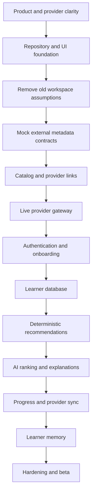

# AlgoMemtor Beginner Development Roadmap

## External Problem Discovery and AI Recommendation Plan

This roadmap replaces the earlier internal problem workspace and code-execution
plan. Do not implement stored statements, examples, starter code, hidden tests,
Monaco, Judge0, code drafts, or internal submissions.

The new core loop is:

```text
learner profile
  -> provider metadata
  -> deterministic filters
  -> AI ranking and explanation
  -> attributed external link
  -> manual or provider-verified evidence
  -> better next recommendation
```

---

## Table of Contents

1. [How to follow the roadmap](#1-how-to-follow-the-roadmap)
2. [Build order](#2-build-order)
3. [Milestone summary](#3-milestone-summary)
4. [Phase 0 — Product and provider clarity](#4-phase-0--product-and-provider-clarity)
5. [Phase 1 — Repository and UI foundation](#5-phase-1--repository-and-ui-foundation)
6. [Phase 2 — Architecture migration](#6-phase-2--architecture-migration)
7. [Phase 3 — Mocked external problem catalog](#7-phase-3--mocked-external-problem-catalog)
8. [Phase 4 — Provider gateway](#8-phase-4--provider-gateway)
9. [Phase 5 — Authentication and onboarding](#9-phase-5--authentication-and-onboarding)
10. [Phase 6 — PostgreSQL and learner data](#10-phase-6--postgresql-and-learner-data)
11. [Phase 7 — Deterministic recommendations](#11-phase-7--deterministic-recommendations)
12. [Phase 8 — AI ranking and explanations](#12-phase-8--ai-ranking-and-explanations)
13. [Phase 9 — Progress and provider linking](#13-phase-9--progress-and-provider-linking)
14. [Phase 10 — Learner memory](#14-phase-10--learner-memory)
15. [Phase 11 — Testing and hardening](#15-phase-11--testing-and-hardening)
16. [Phase 12 — Deployment and beta](#16-phase-12--deployment-and-beta)
17. [After the MVP](#17-after-the-mvp)
18. [Working method](#18-working-method)
19. [Risk register](#19-risk-register)
20. [Final MVP checklist](#20-final-mvp-checklist)

---

# 1. How to Follow the Roadmap

## 1.1 Work in order

Later phases depend on earlier contracts. In particular:

- do not build AI before deterministic candidate filtering works;
- do not add multiple providers before one provider adapter is reliable;
- do not claim verified progress before provider evidence exists; and
- do not use scraping to make a blocked phase appear complete.

## 1.2 Weekly completion rule

A phase is complete only when:

- its acceptance checks pass;
- automated checks pass;
- relevant browser behavior is verified;
- documentation matches implementation; and
- known limitations are written down.

## 1.3 Scope rule

When tempted to add a feature, ask:

1. Does it improve problem discovery or recommendation quality?
2. Can it be built with provider-permitted metadata?
3. Does the user understand the evidence behind it?
4. Will the product still work if AI is unavailable?

If not, defer it.

## 1.4 Provider stop rule

Stop a provider integration when:

- no official or explicitly permitted API/feed exists;
- terms do not permit the intended display or cache;
- attribution cannot be satisfied;
- canonical links cannot be constructed safely; or
- the required fields would need HTML scraping.

Record the provider as deferred. Do not work around the boundary.

---

# 2. Build Order



Why this order:

- Provider contracts determine what the product can honestly show.
- Mock-first UI avoids depending on live API availability.
- Deterministic recommendations provide a baseline and fallback.
- AI improves a working loop instead of becoming the loop's only engine.

---

# 3. Milestone Summary

| Week | Milestone                | Deliverable                                        |
| ---- | ------------------------ | -------------------------------------------------- |
| 1    | Product clarity          | Written metadata-and-redirect boundary             |
| 2    | Repository foundation    | Monorepo and service scaffolding                   |
| 3    | UI foundation            | Responsive shell and placeholder routes            |
| 4    | Architecture migration   | Old editor/judge contracts and docs removed        |
| 5    | Mock catalog             | External metadata cards, filters, and safe links   |
| 6    | Provider gateway         | First live official provider adapter               |
| 7    | Authentication           | Login and protected routes                         |
| 8    | Onboarding               | Learner preferences and provider choices           |
| 9    | Core data                | Profiles, metadata cache, actions, recommendations |
| 10   | Baseline recommendations | Deterministic personalized feed                    |
| 11   | AI recommendations       | Ranked candidates with explanations and fallback   |
| 12   | Progress                 | Honest manual evidence and outbound history        |
| 13   | Provider linking         | One supported verified-activity flow, if permitted |
| 14   | Learner memory           | Evidence-backed user-controlled personalization    |
| 15   | Hardening                | Security, accessibility, testing, observability    |
| 16   | Deployment               | Production beta and feedback loop                  |

Weeks are planning units, not deadlines. Preserve the dependency order even if
the calendar changes.

---

# 4. Phase 0 — Product and Provider Clarity

## Week 1: Define the product boundary

### Goal

Understand exactly what AlgoMemtor owns and what external platforms own.

### Learn

- metadata versus problem content;
- official API versus scraping;
- canonical URLs and open redirects;
- rate limits and caching;
- manual versus verified evidence; and
- AI ranking versus deterministic integration code.

### Build tasks

1. Write a one-page product brief.
2. State that AlgoMemtor does not host or execute problems.
3. Choose the initial learner persona.
4. Define the initial recommendation request.
5. Select one candidate provider with an official metadata API.
6. Review its fields, attribution, rate limit, caching, and URL format.
7. Record unavailable fields explicitly.
8. Define the three question statuses:
   - `unsolved`;
   - `attempted`; and
   - `solved`.
     Keep recommendations, dismissals, and evidence provenance separate from
     question status. Provider-link clicks do not change status.
9. Define success metrics that do not count clicks as solves.

### Acceptance checks

- [ ] The product brief says solving occurs externally.
- [ ] No statement/editor/compiler is part of the MVP.
- [ ] The initial provider has a documented permitted API.
- [ ] Required attribution and rate limits are recorded.
- [ ] Question statuses are limited to `unsolved`, `attempted`, and `solved`.
- [ ] AI is not responsible for URL safety or provider access.

### Deliverable

**Product-boundary checkpoint:** everyone can explain the system in the same
sentence: AlgoMemtor recommends; the provider hosts and judges.

---

# 5. Phase 1 — Repository and UI Foundation

## Week 2: Monorepo and tooling

### Goal

Create a maintainable frontend, core API, AI API, and shared-contract foundation.

### Build tasks

1. Configure npm workspaces.
2. Create `apps/web`, `apps/core-api`, and `apps/ai-api`.
3. Create `packages/shared-contracts`.
4. Add strict TypeScript, ESLint, Prettier, and Ruff.
5. Add health endpoints.
6. Add PostgreSQL through Docker Compose.
7. Create environment examples without real secrets.
8. Add root development and quality commands.
9. Record Express/FastAPI/database ownership in an ADR.

### Acceptance checks

- [ ] All services start independently.
- [ ] Root scripts work.
- [ ] No secrets are tracked.
- [ ] Type-check, lint, format, and builds pass.

## Week 3: UI system, routing, and layouts

### Goal

Create the responsive application shell without product data.

### Build tasks

1. Define accessible design tokens and UI primitives.
2. Build the desktop topbar.
3. Build the mobile/narrow-tablet drawer.
4. Build `AppShell`, `PageContainer`, and `PageHeader`.
5. Add placeholder routes.
6. Add loading, empty, error, and not-found components.
7. Verify responsive behavior and focus states.

### Acceptance checks

- [ ] Routes render inside the correct shell.
- [ ] Desktop uses a horizontal topbar.
- [ ] Mobile uses an accessible drawer.
- [ ] Pages have one main landmark and visible heading.
- [ ] No product data or speculative logic is required yet.

### Deliverable

**Foundation checkpoint:** an accessible shell ready for the new discovery flow.

---

# 6. Phase 2 — Architecture Migration

## Week 4: Remove internal-workspace assumptions

### Goal

Bring source contracts and scaffolding into alignment with the new documentation
before building more features.

### Learn

- migration planning;
- contract compatibility;
- deleting superseded code safely; and
- repository-wide terminology audits.

### Build tasks

1. Check and preserve existing uncommitted changes.
2. Audit source, configuration, fixtures, packages, and tests for:
   - problem statements;
   - examples and constraints;
   - starter code and test cases;
   - Monaco/editor workspace;
   - run/submit workflows;
   - Judge0;
   - drafts, submissions, and verdicts.
3. Replace problem contracts with external metadata contracts.
4. Add provider and external-ID types.
5. Add `canonicalUrl` only to server-validated responses.
6. Replace the internal detail route with a direct external action or a
   metadata-only preview decision.
7. Remove obsolete Judge0 configuration and dependencies.
8. Update mock handlers to metadata-only responses.
9. Remove copied or lookalike statement fixtures.
10. Add a migration note for intentionally deferred source changes.

### Acceptance checks

- [ ] No target contract contains statement, constraints, examples, starter code,
      or tests.
- [ ] No target UI promises an editor, compiler, run, or submit action.
- [ ] No active configuration requires Judge0.
- [ ] Existing unrelated user changes are preserved.
- [ ] All quality commands pass.

### Common mistakes

- Updating docs but keeping incompatible contracts.
- Renaming `ProblemDetail` while leaving statement fields inside it.
- Leaving a generic redirect accepting arbitrary URLs.
- Deleting unrelated uncommitted work.

### Deliverable

**Migration checkpoint:** the repository has one product direction.

---

# 7. Phase 3 — Mocked External Problem Catalog

## Week 5: Contracts, MSW, catalog, and provider links

### Goal

Build the first useful discovery experience entirely with fictional or permitted
metadata.

### Target contract

```ts
type ProviderKey = 'codeforces'

type ExternalProblemSummary = {
  provider: ProviderKey
  externalId: string
  title: string
  canonicalUrl: string
  providerDifficulty?: number | string
  normalizedDifficulty?: 'easy' | 'medium' | 'hard'
  providerTags: string[]
  topics: string[]
  solvedCount?: number
  fetchedAt: string
}
```

### Build tasks

1. Define Zod schemas for provider keys, problems, queries, pagination, provider
   warnings, and the three question statuses.
2. Create 20–30 fictional metadata fixtures.
3. Implement MSW endpoints:
   - `GET /api/providers`;
   - `GET /api/problems`.
4. Add a central API client and TanStack Query hooks.
5. Build problem cards or a table.
6. Add search, provider, topic, rating/difficulty, and status filters.
7. Keep filters in URL search parameters.
8. Add pagination.
9. Add provider attribution and **Solve on Provider** anchors.
10. Add bookmark and dismiss placeholders.
11. Add loading, empty, partial, stale, rate-limited, and error modes.
12. Test keyboard access and new-tab behavior.

### Acceptance checks

- [ ] Catalog loads through MSW, not fixture imports in the page.
- [ ] Filters combine and survive refresh.
- [ ] Every card displays a provider.
- [ ] Every outbound action names its destination provider.
- [ ] Links use approved HTTPS fixtures.
- [ ] Following a provider link does not change question status.
- [ ] No fixture contains a full statement or test case.
- [ ] Cards work on mobile.

### Deliverable

**Mock-discovery checkpoint:** a complete metadata-and-redirect journey without a
live provider.

---

# 8. Phase 4 — Provider Gateway

## Week 6: First live provider adapter

### Goal

Replace metadata mocks with one permitted external API without changing React's
contract.

### Learn

- third-party API clients;
- response validation;
- rate limiting and backoff;
- caching and freshness;
- provider-specific DTOs; and
- URL construction and allowlisting.

### Build tasks

1. Define the `ProblemProvider` interface.
2. Create a Codeforces adapter using the official API.
3. Validate raw envelopes and `Problem`/`ProblemStatistics` fields.
4. Normalize IDs, tags, rating, solved count, and topics.
5. Construct canonical URLs from contest ID and index.
6. Add server-side search/filter support over normalized metadata.
7. Add timeout and retry classification.
8. Add request deduplication.
9. Add a provider-specific metadata TTL.
10. Add safe structured logs.
11. Add provider health/freshness metadata.
12. Test with mocked HTTP responses before live manual testing.

### Acceptance checks

- [x] React never calls Codeforces directly.
- [x] Provider payloads are validated before use.
- [x] Invalid records are skipped or rejected safely.
- [x] Canonical URLs resolve to the expected Codeforces host and problem.
- [x] Documented rate limits are respected.
- [x] Cached results reduce provider calls.
- [x] Provider errors produce stable internal codes.
- [x] The catalog contract matches Week 5 mocks.

### Implemented provider policy

- `problemset.problems` is requested anonymously; catalog access does not need a
  Codeforces API key or secret.
- Provider requests are separated by at least 2.1 seconds, while a one-hour
  in-process metadata TTL and concurrent-refresh deduplication avoid unnecessary
  calls.
- Retryable timeouts, network failures, and `5xx` responses receive at most one
  retry with backoff. Rate-limit failures are returned without an immediate
  retry.
- Valid records without a safe contest/index URL are skipped and reported as
  partial results. Malformed fields are rejected before normalization.
- Difficulty bands are deterministic: an absent rating remains absent, ratings
  at or below `1000` are `easy`, ratings above `1000` through `1500` are
  `medium`, and ratings above `1500` are `hard`.
- Provider freshness includes availability, fetch time, expiry time, stale
  state, and the last stable provider error code when applicable.
- A refresh-failure cooldown serves the stale cache without making a provider
  request for every filter change during an outage.

Automated provider tests and an anonymous live API smoke test passed on
2026-08-09. The live catalog was also exercised through Vite's `/api` proxy and
served by Express. Browser-rendered acceptance remains to be repeated when a
browser-control session is available; no browser was available during this
checkpoint.

### Common mistakes

- Passing provider DTOs directly to React.
- Depending on fields the official API does not supply.
- Fetching on every keystroke.
- Retrying rate-limit failures immediately.
- Scraping statements to enrich cards.

### Deliverable

**Provider checkpoint:** one live, lawful metadata source with safe redirects.

---

# 9. Phase 5 — Authentication and Onboarding

## Week 7: Supabase authentication

### Goal

Add real identity and protected learner routes.

### Build tasks

1. Configure Supabase Auth.
2. Implement login, logout, and session restoration.
3. Verify JWTs in Express and FastAPI.
4. Protect dashboard, recommendations, bookmarks, progress, and settings.
5. Handle loading, expired, and invalid sessions.
6. Configure local and production callback URLs.

### Acceptance checks

- [x] Protected routes redirect correctly.
- [x] APIs reject invalid tokens.
- [x] Refresh restores valid sessions.
- [x] Service-role keys never enter React.

### Implemented authentication policy

- Supabase email/password signup, login, logout, persisted-session restoration,
  and auth-state subscriptions are owned by the React auth provider.
- All documented learner routes are behind one loading-aware route guard.
  Recommendation and bookmark pages remain explicit non-persistent placeholders
  until their later roadmap phases.
- Protected frontend requests attach the current access token, refresh once after
  a `401`, and clear unrecoverable sessions with a user-facing login message.
- Express and FastAPI verify the JWT signature, issuer, `authenticated` audience,
  expiry, subject, and authenticated role through the project's JWKS endpoint.
  Express catalog endpoints and both `/api/me` endpoints require a bearer token.
- Signup confirmation redirects are derived from `VITE_SITE_URL` and use the
  exact `/dashboard` path. The local
  `http://localhost:5173/dashboard` redirect is allowlisted in the Supabase
  project's external URL Configuration. Add the exact production `/dashboard`
  redirect during Week 16 when a production URL exists.

Frontend, Express, and FastAPI auth tests passed on 2026-08-10. All eight learner
routes redirected to login in a real browser, both APIs rejected live
unauthenticated requests, and no browser-console errors were present. On
2026-08-26, a confirmed Supabase user completed the live login flow, browser
refresh preserved the authenticated dashboard session, the protected Codeforces
catalog loaded through Express, logout cleared the local session, and revisiting
the dashboard redirected to login. The local callback allowlist was also saved
and verified in the Supabase Dashboard.

## Week 8: Learner onboarding

### Goal

Collect enough preference data for a useful first recommendation.

### Build tasks

1. Collect goal and experience.
2. Collect preferred/weak topics.
3. Collect preferred providers.
4. Collect rating/difficulty comfort range.
5. Explain optional provider linking without requiring it.
6. Validate and persist the profile.
7. Allow later editing.

### Acceptance checks

- [x] Onboarding works without a linked external account. The provider-linking
      section is optional and the profile API accepts a completed profile without
      any linked provider.
- [x] Required fields are understandable. The shared contract validates the
      required goal, experience, provider, and comfort inputs, while the form
      explains the fields and validation messages.
- [x] Completion leads to the dashboard. A saved complete profile clears the
      onboarding gate and the form navigates to `/dashboard`.
- [x] Settings can correct the profile later. Settings loads and saves the
      authenticated learner's profile, and the PostgreSQL repository preserves it
      across a disconnect/reconnect integration check.

The checks above have automated and local integration evidence. A fresh
authenticated browser pass for the updated onboarding/settings UI remains a
manual follow-up because no signed-in Supabase browser session was available
during this implementation run.

### Deliverable

**Identity checkpoint:** every learner has an editable recommendation profile.

---

# 10. Phase 6 — PostgreSQL and Learner Data

## Week 9: Core schema and persistence

### Goal

Persist learner-owned data and permitted metadata without introducing internal
problem content.

### Build tasks

1. Configure Prisma for the `core` schema.
2. Configure Alembic for the separate `ai` schema.
3. Create core tables for:
   - users;
   - learner profiles;
   - provider accounts and consent;
   - external problem metadata cache;
   - bookmarks;
   - problem actions;
   - recommendation batches; and
   - recommendation feedback.
4. Create unique `(provider, externalId)` indexes.
5. Add ownership checks.
6. Add metadata expiry indexes.
7. Add seed data only for normalized topics and fictional development records.
8. Write idempotent migrations and seeds.

### Acceptance checks

- [x] No table stores statements, tests, drafts, or submissions.
- [x] Prisma and Alembic never own the same table.
- [x] Learners can access only their own records.
- [x] Metadata rows deduplicate correctly.
- [x] Seed scripts can run safely more than once.

The Week 9 migration and repository checks passed on 2026-09-10. Prisma owns
the `core` tables and Alembic has a separate baseline for the `ai` schema with a
distinct version table. Owner-scoped repository tests cover bookmarks, actions,
recommendation history, and feedback, including rejected cross-learner
references. A disposable PostgreSQL database verified fresh migration order,
repeat migration safety, metadata replacement without duplicate identities,
durability across reconnects, and two consecutive normalized-topic seed runs.
The provider gateway now hydrates and refreshes the permitted metadata cache;
failed cache reads or writes remain non-fatal and stale data is identified
honestly.

### Deliverable

**Data checkpoint:** durable learner and metadata records with clear ownership.

---

# 11. Phase 7 — Deterministic Recommendations

## Week 10: Explainable baseline ranking

### Goal

Create a useful recommendation feed before adding an LLM.

### Build tasks

1. Fetch candidates through the provider gateway.
2. Exclude dismissed recommendations and recently solved problems.
3. Score topic match.
4. Score difficulty-range match.
5. Score provider preference.
6. Add revision and diversity rules.
7. Generate template-based reasons.
8. Save recommendation batches.
9. Add useful/not-useful and too-easy/too-hard feedback.
10. Add cold-start defaults.

### Example baseline score

```text
score =
  topic_match * 0.35
  + difficulty_match * 0.30
  + provider_preference * 0.15
  + revision_need * 0.10
  + diversity_bonus * 0.10
```

Weights are a starting hypothesis, not truth. Record them and measure feedback.

### Acceptance checks

- [x] Recommendations work without FastAPI or an LLM.
- [x] Every item has an understandable reason.
- [x] Dismissed items do not immediately return.
- [x] Difficulty preferences affect ranking.
- [x] Cold-start users receive safe starter problems.
- [x] Results are reproducible for the same inputs.

The Week 10 baseline is implemented as `deterministic-v1`. Shared contract
validation, ranking unit tests, API ownership/feedback/dismissal tests, the
Codeforces topic-alias tests, and the recommendation card test pass locally.
Live PostgreSQL migration deployment and authenticated browser QA remain
environment-dependent follow-ups when the local database and Supabase session
are available.

### Deliverable

**Baseline checkpoint:** a useful, measurable recommendation system without AI.

---

# 12. Phase 8 — AI Ranking and Explanations

## Week 11: FastAPI recommendation intelligence

### Goal

Improve candidate ordering and explanations while keeping deterministic safety
and fallback behavior.

### Learn

- structured LLM output;
- prompt boundaries;
- candidate allowlisting;
- evaluation datasets;
- latency and cost budgets; and
- graceful degradation.

### Build tasks

1. Define Pydantic ranking input/output models.
2. Send only a bounded normalized candidate list.
3. Exclude canonical URLs when the model does not need them.
4. Ask for selected IDs, scores, and concise reasons.
5. Validate output IDs against the candidate set.
6. Attach canonical URLs in Express after validation.
7. Add timeouts and cancellation.
8. Fall back to Week 10 ranking on any AI failure.
9. Record model, latency, fallback, and candidate IDs.
10. Build an evaluation set for relevance, difficulty, diversity, and reason
    quality.
11. Add natural-language preference input.

### Current implementation and evidence

The current Week 11 slice is implemented locally across the Express core API,
FastAPI AI API, shared contracts, and focused tests. Express still owns provider
access and deterministic filtering. It creates a maximum 40-item Codeforces
shortlist, sends normalized metadata and learner context to FastAPI through the
internal ranking client, validates the returned IDs and reasons again, and only
then attaches the provider-owned canonical URLs. A successful batch is stored as
`rankingMode: "ai"` with version `ai-gemini-rag-v1`; every fallback is stored as
`rankingMode: "deterministic"` with version
`ai-rag-v1-fallback-deterministic-v2`.

FastAPI exposes `POST /internal/recommendations/rank`, protected by the shared
`X-Internal-Service-Token`. With `LLM_API_KEY` configured it uses the configured
Gemini model through `langchain-google-genai` and Pydantic structured output. The
request is capped at 40 unique Codeforces metadata candidates and the response
must contain the expected number of unique, allowlisted IDs, scores from 0 to 1,
and reasons no longer than 240 characters. Canonical URLs, request IDs, and
learner IDs are not sent to Gemini; the optional saved recommendation note is
bounded to 500 characters, while structured profile choices remain authoritative.

The AI service returns stable fallback reasons for missing configuration,
timeouts, provider errors, and invalid output. The core client also falls back
for transport, non-success HTTP, timeout, invalid JSON, or invalid response
schema failures. Audit writes are best-effort: when the AI `DATABASE_URL` is
configured, `ai.ranking_audits` records model/version, candidate and returned
IDs, pricing version, fallback state, latency, token usage, estimated cost, and a
keyed HMAC-SHA256 fingerprint of the optional recommendation note; raw prompts
and note text are not stored. Audit writes have a bounded timeout, use a no-op
repository when no database is configured, and an audit write failure does not
make ranking unavailable.

The checked acceptance items below are supported by local unit and API tests,
including invalid-ID, duplicate-ID, invalid-count, unsafe-reason, timeout,
provider-error, missing-configuration, outage-fallback, and trusted-URL cases.
They are not evidence of live Gemini quality, production latency or cost, or
browser acceptance.

### Acceptance checks

- [x] AI cannot introduce an unknown problem or URL.
- [x] Invalid output activates deterministic fallback.
- [x] Recommendations remain available during AI outage.
- [ ] Reasons do not expose private learner data.
- [ ] Latency and cost are measured.
- [ ] An evaluation compares AI against the baseline.

The 48-scenario evaluation dataset and runner are present in
`apps/core-api/evaluation/dataset.json` and `apps/core-api/evaluation/run.ts`.
`npx tsx apps/core-api/evaluation/run.ts --validate-only` validates the dataset
without contacting Gemini. A live AI-vs-baseline run is explicitly opt-in and
requires a configured AI URL and internal token; it gates on allowlist/schema
safety, at least five percentage points of weighted improvement, p95 latency
below eight seconds, and average estimated cost at or below $0.02. The local
validation is not live quality, latency, cost, or authenticated browser
evidence, so those release checks remain pending.

### Deferred Week 11 scope

- Live Gemini latency, cost, and quality measurements with a representative
  evaluation set.
- Browser verification with a real authenticated session and live Gemini
  credentials.
- General conversational preference handling; the implemented input is one
  optional, profile-scoped recommendation note rather than a chat or memory
  system.

### Common mistakes

- Asking the model to browse arbitrary sites.
- Treating fluent reasons as proof of good ranking.
- Sending thousands of candidates.
- Removing the baseline after AI works once.
- Persisting unnecessary raw prompts.

### Deliverable

**AI checkpoint:** bounded AI improves a safe, functioning recommendation loop.

---

# 13. Phase 9 — Progress and Provider Linking

## Week 12: Honest manual progress

### Goal

Track what AlgoMemtor genuinely knows after external navigation.

### Build tasks

1. Record recommendation impressions separately from opens.
2. Record outbound opens without blocking navigation.
3. Add actions for the `attempted` and `solved` statuses.
4. Add perceived difficulty and time-spent reflection.
5. Show the three question-status labels consistently everywhere.
6. Keep append-only evidence history where practical.
7. Update recommendation exclusions and revision rules.

### Current local implementation

The progress slice now includes append-only manual status events, persistent
bookmarks, recommendation impressions and non-blocking opens, reflections,
server-timed sessions with concurrency and four-hour capping, a protected
analytics/history dashboard, and durable outbox hooks for learner-memory
processing. Catalog, recommendation, bookmark, and progress views share the
same status, bookmark, reflection, and timer controls. The implementation is
also wired for profile-scoped AI note consent and learner-data deletion while
provider-confirmed activity remains intentionally outside this week.

### Acceptance checks

- [ ] Opening never becomes completion.
- [ ] Question status is always `unsolved`, `attempted`, or `solved`.
- [ ] Back navigation preserves the recommendation/catalog state.
- [ ] Reflection data changes later recommendations.

## Week 13: One provider-verified activity flow

### Goal

Verify solves only where the initial provider API and terms permit reliable,
consented user activity access.

### Build tasks

1. Document the provider activity endpoint and evidence mapping.
2. Add explicit link/consent UI.
3. Validate handles or authorization.
4. Fetch activity through Express.
5. Normalize and deduplicate provider events.
6. Store last successful sync and errors.
7. Mark confirmed solves as `solved` and retain provider verification as
   separate evidence.
8. Add disconnect and learner-data deletion.
9. Rate-limit manual sync.
10. Add reconciliation tests.

If reliable verification is not permitted, ship Week 12 without Week 13 and label
provider verification as deferred. Do not fake it. See
`docs/adr/0003-provider-verified-activity-deferral.md` for the CodeChef and
LeetCode decision and the incomplete Week 13 gate.

### Acceptance checks

- [ ] User consent is explicit.
- [ ] Confirmed provider evidence can set the question status to `solved`.
- [ ] Evidence provenance remains separate from the three question statuses.
- [ ] Sync failures do not erase previous evidence.
- [ ] Disconnect and deletion work.

### Deliverable

**Progress checkpoint:** trustworthy evidence with no inflated solve counts.

---

# 14. Phase 10 — Learner Memory

## Week 14: Evidence-backed personalization

### Goal

Remember useful learner patterns without creating an opaque permanent profile.

### Build tasks

1. Configure the `ai` schema.
2. Define memory categories:
   - preference;
   - difficulty calibration;
   - topic weakness;
   - scheduling preference; and
   - recommendation feedback pattern.
3. Link every memory to evidence.
4. Add confidence and status.
5. Let users inspect, correct, archive, and delete memories.
6. Use simple SQL retrieval first.
7. Add embeddings only when semantic retrieval is measurably helpful.
8. Exclude low-confidence memories from strong claims.
9. Test memory influence on recommendations.

### Current local implementation

The learner-memory slice is implemented locally with a separate Alembic-owned
`ai` schema, consent-aware reflection summarization, confidence thresholds,
inspect/correct/archive/restore/delete controls, durable core outbox jobs,
Gemini embeddings at 768 dimensions, owner-scoped cosine retrieval, and
bounded RAG input to the recommendation ranker. Raw notes, prompts, provider
URLs, and problem content are excluded from memory and audit persistence.
Local tests cover the contracts and failure boundaries; live PostgreSQL,
Gemini, embedding, worker-restart, and authenticated-browser evidence remain
release gates rather than being marked complete here.

### Acceptance checks

- [ ] Every active memory has evidence.
- [ ] Users can correct and delete memories.
- [ ] A click alone does not create a “solved” memory.
- [ ] Manual and verified evidence are distinguishable.
- [ ] Recommendations explain relevant memory influence without exposing private
      details.

### Deliverable

**Memory checkpoint:** personalization improves over time and remains under user
control.

---

# 15. Phase 11 — Testing and Hardening

## Week 15: Release candidate

### Goal

Verify the complete learner loop under normal and degraded conditions.

### Functional tasks

1. Test onboarding.
2. Test combined catalog filters.
3. Test deterministic recommendations.
4. Test AI recommendations and fallback.
5. Test outbound navigation.
6. Test manual progress.
7. Test provider verification if supported.
8. Test memory controls.

### Provider tasks

1. Test valid, missing, and malformed fields.
2. Test rate limits and timeouts.
3. Test cache expiry and stale display.
4. Test partial-provider results.
5. Confirm no statement/content ingestion.
6. Re-check provider API terms and attribution.

### Security tasks

1. Review CORS and auth.
2. Test cross-user record access.
3. Test redirect allowlists and lookalike hosts.
4. Confirm React receives no provider/LLM secrets.
5. Confirm AI cannot introduce candidate IDs or URLs.
6. Confirm disconnect/deletion behavior.

### Accessibility tasks

1. Complete keyboard navigation.
2. Verify focus styles and external-link labels.
3. Verify screen-reader names for provider actions.
4. Check contrast and zoom.
5. Verify mobile layouts at narrow widths.

### Performance tasks

1. Measure catalog API latency.
2. Measure provider cache hit rate.
3. Measure AI latency and fallback rate.
4. Paginate or virtualize only when measured.
5. Avoid fetching providers on every filter keystroke.

### Acceptance checks

- [ ] The end-to-end loop works in a real browser.
- [ ] Provider and AI outages have usable fallbacks.
- [ ] No open redirect is possible.
- [ ] Evidence labels remain correct.
- [ ] No prohibited problem content is stored.
- [ ] Automated quality commands pass.
- [ ] Known limitations are documented.

### Deliverable

**Release-candidate checkpoint:** the product is safe enough for a small beta.

---

# 16. Phase 12 — Deployment and Beta

## Week 16: Production setup and feedback

### Goal

Deploy the smallest production system and learn whether recommendations help.

### Build tasks

1. Deploy PostgreSQL.
2. Deploy Express.
3. Configure production provider integration and limits.
4. Deploy FastAPI.
5. Deploy React.
6. Configure Supabase production callbacks.
7. Configure secrets and internal authentication.
8. Add health checks and structured logging.
9. Add provider/AI error alerts.
10. Add privacy, terms, attribution, and data-deletion pages.
11. Run production smoke tests.

### Production smoke test

1. Create an account.
2. Complete onboarding.
3. Load live external metadata.
4. Request an AI recommendation.
5. Confirm provider attribution and destination.
6. Open the external problem.
7. Return and mark progress manually.
8. Verify provider activity if supported.
9. Edit or delete a learner memory.
10. Disconnect a provider account.

### Beta questions

- Was the recommended difficulty appropriate?
- Did the reason help the learner decide?
- Did the external link lead to the expected problem?
- Was returning to AlgoMemtor natural?
- Did manual progress feel burdensome?
- Did users understand manual versus verified evidence?
- Which provider or topic was missing?

### Beta success targets

Set targets only after measuring a baseline. Track:

- recommendation open rate;
- useful/not-useful feedback;
- manual and verified completion separately;
- repeat practice days;
- provider error rate;
- AI fallback rate; and
- broken destination rate.

### Deliverable

**Beta checkpoint:** real learners complete the discovery-to-reflection loop.

---

# 17. After the MVP

## 17.1 Recommended order

### Stage A: Improve recommendation quality

- calibrate difficulty per learner;
- improve topic normalization;
- add revision scheduling;
- compare AI and deterministic ranking; and
- improve explanation usefulness.

### Stage B: Add providers carefully

For each provider, repeat the approval checklist, adapter tests, attribution work,
and fallback design. Do not create a single generic scraper.

### Stage C: Improve progress evidence

- add more consented provider activity integrations;
- improve reconciliation;
- add reflection prompts; and
- make confidence visible.

### Stage D: Planning features

- external contest recommendations;
- upsolve lists;
- interview practice plans;
- study groups and accountability; and
- curated resource links.

### Stage E: Scale measured bottlenecks

- Redis for coordinated provider cache;
- background refresh workers;
- event queues for durable sync jobs;
- separate vector storage only if PostgreSQL is insufficient.

## 17.2 Still out of scope unless a new ADR changes direction

- mirrored problem statements;
- embedded IDE/compiler;
- internal code judging;
- hidden test-case storage;
- HTML scraping; and
- pretending to be the source platform.

---

# 18. Working Method

## 18.1 Weekly rhythm

### Session 1 — Learn and plan

- Read the milestone.
- Inspect the current checkout.
- Compare source with docs.
- Break work into small tasks.
- Identify provider or security assumptions.

### Sessions 2–4 — Build

- Make one focused change.
- Test it.
- Record unexpected behavior.
- Preserve unrelated changes.

### Session 5 — Verify and document

- Run automated checks.
- Verify browser behavior.
- Review the diff.
- Update docs and decision notes.
- Record anything not verified.

## 18.2 Task sizing

Good tasks:

- “Define the provider-key Zod schema.”
- “Normalize Codeforces rating into display bands.”
- “Reject unknown hosts in the redirect resolver.”
- “Render a stale-provider warning.”
- “Test that an open does not become a solve.”

Tasks that are too broad:

- “Build all providers.”
- “Finish AI.”
- “Implement the backend.”
- “Make recommendations smart.”

## 18.3 Decision log

Record decisions with:

- date;
- context;
- decision;
- alternatives;
- consequences; and
- review trigger.

Create a new ADR if the change affects service ownership, provider/content
boundaries, evidence meaning, or AI safety.

---

# 19. Risk Register

| Risk                     | Warning sign                    | MVP response                     | Later option                               |
| ------------------------ | ------------------------------- | -------------------------------- | ------------------------------------------ |
| Provider API unavailable | high error/timeout rate         | cached/partial results and retry | background refresh or alternative provider |
| Provider terms change    | integration no longer compliant | disable provider                 | renegotiate or replace                     |
| Rate limits exceeded     | frequent throttling             | cache, debounce, backoff         | coordinated cache/worker                   |
| AI hallucinates IDs      | unknown candidate returned      | reject and fallback              | stronger constrained decoding              |
| AI adds little value     | baseline performs equally       | keep baseline/default            | revise evaluation/prompt                   |
| Redirect vulnerability   | arbitrary host accepted         | server mapping and allowlist     | security review automation                 |
| False progress claims    | opens counted as solves         | separate events and status       | more provider verification                 |
| Stale metadata           | broken links/difficulty         | freshness labels and expiry      | background reconciliation                  |
| Too many providers       | adapter inconsistency           | one provider first               | provider certification checklist           |
| Privacy overreach        | users distrust account linking  | optional consent and deletion    | privacy review                             |

---

# 20. Final MVP Checklist

## Product

- [ ] AlgoMemtor recommends external problems.
- [ ] Source platforms host and judge them.
- [ ] Every recommendation explains why it fits.
- [ ] Manual and verified progress are distinct.
- [ ] No click is called a solve.

## Frontend

- [ ] Responsive shell works.
- [ ] Catalog filters persist in the URL.
- [ ] Provider attribution is visible.
- [ ] External actions are accessible and correctly labelled.
- [ ] Loading, empty, stale, partial, and error states exist.
- [ ] No embedded editor/workspace remains.

## Provider gateway

- [ ] At least one official permitted provider is integrated.
- [ ] Raw responses are validated.
- [ ] Metadata is normalized.
- [ ] URLs are constructed or allowlisted server-side.
- [ ] Rate limits, timeouts, cache, and retries are tested.
- [ ] No scraping is used.

## Express

- [ ] Authentication and ownership checks work.
- [ ] Provider secrets remain server-side.
- [ ] Bookmarks and progress persist.
- [ ] Recommendation orchestration validates AI output.
- [ ] Deterministic fallback works.

## FastAPI

- [ ] AI ranks only supplied candidates.
- [ ] Structured output is validated.
- [ ] Reasons are concise and relevant.
- [ ] Model failures activate fallback.
- [ ] Learner memories are evidence-backed and user-controlled.

## Database

- [ ] Core and AI migration ownership is separate.
- [ ] `(provider, externalId)` deduplicates metadata.
- [ ] No statements, tests, source code, drafts, or submissions are stored.
- [ ] Provider account consent and deletion are represented.

## Security and compliance

- [ ] No open redirect is possible.
- [ ] Only approved HTTPS provider hosts are used.
- [ ] Provider terms and attribution are documented.
- [ ] No secrets are exposed or committed.
- [ ] AI cannot introduce arbitrary URLs.
- [ ] Cross-user access tests pass.

## Quality

- [ ] Type-check passes.
- [ ] Lint passes.
- [ ] Format check passes.
- [ ] Tests pass.
- [ ] Production build passes.
- [ ] Browser acceptance checks pass.
- [ ] Documentation matches the implementation.

## Closing advice

Build the smallest trustworthy loop first. A single reliable provider, clear
recommendation reason, safe external link, and honest progress signal are more
valuable than a large catalog built on copied content or unsupported scraping.
