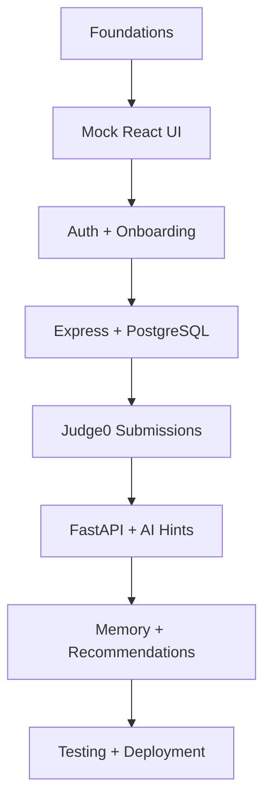

# MentorForge Beginner Development Roadmap

> A practical, milestone-based plan for building MentorForge from an empty folder to a deployed MVP.

**Project:** MentorForge — Your Persistent AI Coding Coach  
**Audience:** Beginner or early-intermediate developer  
**Suggested pace:** 12–15 hours per week  
**Estimated duration:** 18 weeks  
**Technical reference:** [`PROJECT_DOCUMENTATION.md`](./PROJECT_DOCUMENTATION.md)

---

## Table of Contents

1. [How to Follow This Roadmap](#1-how-to-follow-this-roadmap)
2. [The Build Order](#2-the-build-order)
3. [Milestone Summary](#3-milestone-summary)
4. [Phase 0 — Preparation](#4-phase-0--preparation)
5. [Phase 1 — Repository and UI Foundation](#5-phase-1--repository-and-ui-foundation)
6. [Phase 2 — Mocked Problem Catalog](#6-phase-2--mocked-problem-catalog)
7. [Phase 3 — Mocked Coding Workspace](#7-phase-3--mocked-coding-workspace)
8. [Phase 4 — Authentication and Onboarding](#8-phase-4--authentication-and-onboarding)
9. [Phase 5 — Express, PostgreSQL, and Core Data](#9-phase-5--express-postgresql-and-core-data)
10. [Phase 6 — Real Problem and Submission APIs](#10-phase-6--real-problem-and-submission-apis)
11. [Phase 7 — Judge0 Code Execution](#11-phase-7--judge0-code-execution)
12. [Phase 8 — FastAPI AI Foundation](#12-phase-8--fastapi-ai-foundation)
13. [Phase 9 — Progressive AI Hints](#13-phase-9--progressive-ai-hints)
14. [Phase 10 — Learner Memory](#14-phase-10--learner-memory)
15. [Phase 11 — Recommendations and Progress](#15-phase-11--recommendations-and-progress)
16. [Phase 12 — Testing and Hardening](#16-phase-12--testing-and-hardening)
17. [Phase 13 — Deployment and Beta](#17-phase-13--deployment-and-beta)
18. [After the MVP](#18-after-the-mvp)
19. [Weekly Working Method](#19-weekly-working-method)
20. [Risk Register](#20-risk-register)
21. [Final MVP Checklist](#21-final-mvp-checklist)

---

# 1. How to Follow This Roadmap

This roadmap is intentionally slower than a hackathon tutorial. It assumes you are learning while building.

## 1.1 Time expectations

At 12–15 hours per week:

- 3–4 sessions for implementation;
- 1 shorter session for learning;
- 1 short review/testing session.

If you have only 6–8 hours per week, treat each “week” below as two calendar weeks. Do not skip acceptance checks to catch up.

## 1.2 What to do when stuck

Use this order:

1. Read the error carefully.
2. Reproduce it with the smallest possible case.
3. Check browser Network/Console or server logs.
4. Read the official documentation for the exact tool.
5. Explain the expected flow in plain language.
6. Ask for help with the error, expected result, actual result, and relevant code.

Do not respond to confusion by installing another library.

## 1.3 The stop rule

Do not begin the next phase unless:

- the current deliverable runs;
- acceptance checks pass;
- the work is committed;
- known problems are recorded;
- setup instructions are updated.

## 1.4 The scope rule

During the 18-week MVP, do not add:

- duels;
- real-time multiplayer;
- public leaderboards;
- microservices beyond Express and FastAPI;
- message brokers;
- Kubernetes;
- custom code runners;
- separate vector databases;
- agent frameworks;
- payments;
- mobile applications.

Write attractive ideas in `docs/BACKLOG.md` instead of implementing them.

---

# 2. The Build Order



This sequence reduces simultaneous unknowns:

- First you learn the product through the UI.
- Then you persist ordinary data.
- Then you integrate untrusted code execution.
- Finally you add AI to a working product.

---

# 3. Milestone Summary

| Week | Milestone | Main outcome |
|---:|---|---|
| 1 | Preparation | Tools installed and concepts reviewed |
| 2 | Repository foundation | Monorepo and quality tooling |
| 3 | UI system and routing | Navigable responsive shell |
| 4 | Problem catalog | Complete mock catalog |
| 5 | Coding workspace | Monaco and simulated run/submit |
| 6 | UX states and mock flows | Frontend-first prototype complete |
| 7 | Supabase authentication | Login and protected routes |
| 8 | Onboarding | Persisted learner setup |
| 9 | Express and PostgreSQL | Core API and database running |
| 10 | Problems and profiles API | Mocks replaced for core reads |
| 11 | Submission data flow | Real submission records |
| 12 | Judge0 | Real code execution |
| 13 | FastAPI foundation | AI service and internal contracts |
| 14 | Progressive hints | Streamed AI hints |
| 15 | Learner memory | Evidence-backed memories |
| 16 | Recommendations/progress | Personalized core loop |
| 17 | Test and harden | Reliable release candidate |
| 18 | Deploy and beta | Live MVP with feedback loop |

The milestones are targets, not deadlines. Quality gates matter more than calendar dates.

---

# 4. Phase 0 — Preparation

## Week 1: Skills, tools, and product clarity

### Goal

Prepare your machine, understand the architecture, and define exactly what you will build.

### Learn

Spend focused time on:

- Git repositories, commits, branches, and pull requests;
- JavaScript `async/await`;
- TypeScript interfaces and unions;
- React components, props, state, and effects;
- HTTP methods and JSON;
- SQL tables, keys, joins, and indexes;
- Python type hints and virtual environments;
- environment variables.

You do not need mastery. You need enough familiarity to recognize each concept.

### Build tasks

1. Install all prerequisites from `PROJECT_DOCUMENTATION.md`.
2. Verify every command:

   ```bash
   git --version
   node --version
   npm --version
   python --version
   uv --version
   docker --version
   docker compose version
   ```

3. Create accounts for GitHub only. Delay other provider accounts.
4. Read sections 1–10 of `PROJECT_DOCUMENTATION.md`.
5. Write a one-page product summary in `docs/PRODUCT_BRIEF.md`.
6. Create `docs/BACKLOG.md` for deferred ideas.
7. Create a simple sketch for:
   - dashboard;
   - problem catalog;
   - problem workspace;
   - progress page.
8. Decide on:
   - project name;
   - colors;
   - basic logo/text mark;
   - initial four programming languages.

### Product brief questions

Answer:

- Who is the first user?
- What problem do they face?
- What is the single most important user loop?
- What does the MVP intentionally exclude?
- What would make a five-person beta successful?

### Acceptance checks

- [ ] All required software opens and reports a version.
- [ ] GitHub repository exists.
- [ ] Product brief is committed.
- [ ] Four screen sketches exist.
- [ ] MVP and non-MVP lists are written.
- [ ] You can explain why Express and FastAPI have different jobs.

### Common mistakes

- Watching many tutorials without building anything.
- Designing 20 screens before validating four primary screens.
- Creating provider accounts and secrets before they are needed.
- Treating a logo as more important than the core loop.

### Deliverable

**Preparation checkpoint:** a repository containing product brief, backlog, documentation, and screen sketches.

---

# 5. Phase 1 — Repository and UI Foundation

## Week 2: Monorepo and tooling

### Goal

Create a clean project that every later phase can extend.

### Learn

- `package.json` scripts;
- TypeScript configuration;
- linting versus formatting;
- environment files;
- monorepo basics;
- semantic commits.

### Build tasks

1. Create the repository structure from the documentation.
2. Scaffold React with Vite and TypeScript.
3. Create empty `apps/core-api` and `apps/ai-api` placeholders.
4. Configure:
   - ESLint;
   - Prettier;
   - TypeScript strict mode;
   - `.editorconfig`;
   - `.gitignore`;
   - `.env.example`.
5. Add root scripts for frontend development.
6. Add a basic `README.md` with setup steps.
7. Create the first Architecture Decision Record:
   - React rather than Next.js;
   - Express for core APIs;
   - FastAPI for AI;
   - PostgreSQL as the primary database.
8. Create a pull-request template.
9. Add a minimal continuous-integration workflow that installs and type-checks the React app.

### Suggested commits

```text
chore: initialize MentorForge monorepo
chore(web): configure TypeScript and linting
docs: add architecture decision records
ci: add frontend typecheck workflow
```

### Acceptance checks

- [ ] A fresh clone can run `npm install`.
- [ ] `apps/web` starts successfully.
- [ ] Type checking passes.
- [ ] Linting passes.
- [ ] `.env.example` contains no secrets.
- [ ] README setup instructions work.
- [ ] CI passes on the main branch.

### Common mistakes

- Globally installing packages that should be project dependencies.
- Committing `node_modules`.
- Disabling strict TypeScript because of the first error.
- Adding Turborepo/Nx before basic npm scripts become insufficient.

## Week 3: UI system, routing, and layouts

### Goal

Build a responsive application shell with all primary routes.

### Learn

- React Router route configuration;
- nested layouts;
- responsive CSS;
- accessible navigation;
- component variants;
- semantic HTML.

### Build tasks

1. Configure Tailwind CSS using current official guidance.
2. Configure shadcn/ui or create a small component set.
3. Define design tokens:
   - colors;
   - spacing;
   - border radius;
   - typography;
   - shadows.
4. Create:
   - `AppShell`;
   - desktop sidebar;
   - mobile navigation;
   - top bar;
   - page container;
   - page header.
5. Add routes with placeholder content:
   - `/`;
   - `/login`;
   - `/onboarding`;
   - `/dashboard`;
   - `/problems`;
   - `/problems/:problemId`;
   - `/submissions`;
   - `/progress`;
   - `/profile`;
   - `/settings`;
   - not found.
6. Create reusable states:
   - `PageSkeleton`;
   - `EmptyState`;
   - `ErrorState`;
   - `NotFoundPage`.
7. Test keyboard navigation and mobile widths.

### Acceptance checks

- [ ] Every route renders.
- [ ] Active navigation is visible.
- [ ] Sidebar becomes mobile navigation at narrow widths.
- [ ] Keyboard focus is visible.
- [ ] No horizontal overflow at 360 px width.
- [ ] Placeholder loading/error/empty states exist.
- [ ] Directly visiting a route works in development.

### Common mistakes

- Creating a separate custom button for every page.
- Hard-coding colors instead of using tokens.
- Building only at desktop width.
- Using clickable `div` elements instead of buttons/links.

### Deliverable

**UI foundation checkpoint:** a polished but data-free navigable application.

---

# 6. Phase 2 — Mocked Problem Catalog

## Week 4: Data contracts, MSW, catalog, and filters

### Goal

Build the first useful product feature entirely with mock data.

### Learn

- HTTP request/response contracts;
- TanStack Query;
- Mock Service Worker;
- URL search parameters;
- runtime validation with Zod.

### Build tasks

1. Define types:

   ```ts
   type Difficulty = "easy" | "medium" | "hard";

   type ProblemSummary = {
     id: string;
     slug: string;
     title: string;
     difficulty: Difficulty;
     topics: string[];
     status: "not_started" | "attempted" | "solved";
     acceptanceRate?: number;
   };
   ```

2. Create 20–30 realistic problem fixtures.
3. Install and initialize MSW.
4. Implement mock endpoints:
   - `GET /api/problems`;
   - `GET /api/problems/:problemId`;
   - `GET /api/topics`.
5. Create a central API client.
6. Configure TanStack Query.
7. Build:
   - problem cards/table;
   - search input;
   - difficulty filter;
   - topic filter;
   - status filter;
   - pagination.
8. Store filters in URL search parameters.
9. Add:
   - loading skeletons;
   - empty filtered results;
   - mock API error;
   - retry action.
10. Add tests for filter behavior.

### Acceptance checks

- [ ] Catalog loads through MSW, not direct imports.
- [ ] Search and filters can be combined.
- [ ] Refresh preserves URL filters.
- [ ] Loading skeleton appears.
- [ ] Error mode displays retry.
- [ ] Empty mode gives a clear reset action.
- [ ] Cards are usable on mobile.
- [ ] Problem types are validated.

### Common mistakes

- Importing fixture arrays directly into pages.
- Copying fetched data to Zustand.
- Filtering only in the UI while pretending the API does it.
- Using inconsistent difficulty strings.

### Deliverable

**Problem catalog checkpoint:** a realistic, testable catalog ready for a future API.

---

# 7. Phase 3 — Mocked Coding Workspace

## Week 5: Problem detail and Monaco Editor

### Goal

Create the central learning screen.

### Learn

- Monaco Editor integration;
- controlled versus uncontrolled values;
- debouncing;
- resizable panels or tab layouts;
- preserving drafts;
- displaying Markdown safely.

### Build tasks

1. Expand the problem-detail contract:
   - statement;
   - constraints;
   - examples;
   - topics;
   - starter code per language.
2. Build problem statement sections.
3. Integrate Monaco using a dynamic/lazy import.
4. Add language selector:
   - C++17/20;
   - Python 3;
   - Java;
   - JavaScript.
5. Create an editor store containing:
   - code by problem/language;
   - selected language;
   - editor theme;
   - active bottom panel.
6. Save drafts to `localStorage` or IndexedDB with debouncing.
7. Add Run and Submit buttons.
8. Build console/verdict panel.
9. Build mobile tabs for statement, editor, and results.
10. Warn before replacing a non-empty draft with starter code.

### Acceptance checks

- [ ] Editor loads without blocking the entire page bundle.
- [ ] Switching language changes to the correct draft.
- [ ] Refresh restores the draft.
- [ ] Long code remains usable.
- [ ] Problem statement scrolls independently on desktop.
- [ ] Mobile tabs are readable and usable.
- [ ] Run and Submit have disabled/loading states.

### Common mistakes

- Replacing code every time language state rerenders.
- Saving on every keystroke without debouncing.
- Loading Monaco on the landing page bundle.
- Treating custom input and hidden-test submission as the same action.

## Week 6: Simulated execution, hints, dashboard, and complete mock flow

### Goal

Complete the frontend-first MVP prototype before introducing real services.

### Build tasks

1. Mock `POST /api/submissions/run` with delays and outcomes.
2. Mock `POST /api/submissions`.
3. Support verdicts:
   - accepted;
   - wrong answer;
   - compile error;
   - runtime error;
   - time limit exceeded;
   - system error.
4. Build a progressive hint panel with five locked/unlocked levels.
5. Simulate streaming hint text.
6. Build mocked:
   - dashboard;
   - submission history;
   - progress page;
   - recommendation card.
7. Create scenario selection in development.
8. Add Playwright and write one full mocked journey.
9. Ask 2–3 classmates to use the prototype without instructions.
10. Record confusing points and fix the top five.

### Acceptance checks

- [ ] User can complete an entire mocked learning loop.
- [ ] Every verdict has a designed state.
- [ ] Hint streaming can be cancelled/retried.
- [ ] Submission appears in mocked history.
- [ ] Dashboard changes after mock acceptance.
- [ ] One Playwright happy path passes.
- [ ] Usability feedback is recorded.

### Frontend-first exit gate

Do not begin real backend work until:

- routes are stable;
- data contracts are written;
- critical states are designed;
- the complete mock flow works;
- major usability problems are fixed.

### Deliverable

**Frontend prototype checkpoint:** a polished demo that behaves like the future product.

---

# 8. Phase 4 — Authentication and Onboarding

## Week 7: Supabase authentication

### Goal

Replace fake identity with real login and protected routes.

### Learn

- sessions;
- JWTs;
- publishable versus secret keys;
- auth state changes;
- protected routes;
- redirect URLs.

### Build tasks

1. Create a Supabase development project.
2. Configure local and future callback URLs.
3. Add frontend environment variables.
4. Create one Supabase client module.
5. Build:
   - sign-up form;
   - login form;
   - email verification/magic-link state if used;
   - logout;
   - expired-session state.
6. Create `AuthProvider`.
7. Create `ProtectedRoute`.
8. Add token attachment to API client.
9. Do not add social OAuth yet.
10. Document auth setup in README.

### Acceptance checks

- [ ] User can register.
- [ ] User can sign in after refresh.
- [ ] User can sign out.
- [ ] Protected routes redirect correctly.
- [ ] Auth callback handles success and error.
- [ ] No secret/service-role key exists in browser code.
- [ ] Login works in a fresh private browser window.

### Common mistakes

- Using a service-role key in React.
- Creating Supabase clients in multiple components.
- Assuming a user session equals completed onboarding.
- Forgetting production callback URLs later.

## Week 8: Onboarding and learner profile

### Goal

Collect the minimum information needed for personalization.

### Build tasks

1. Build a five-step onboarding form.
2. Validate each step with Zod.
3. Save temporary progress locally.
4. Use mock persistence initially.
5. Add onboarding route guard:
   - unauthenticated → login;
   - authenticated + incomplete → onboarding;
   - authenticated + complete → dashboard.
6. Build profile editing.
7. Keep questions minimal:
   - goal;
   - experience;
   - language;
   - known topics;
   - weekly target.
8. Add summary confirmation before completion.
9. Test back/forward navigation and refresh.

### Acceptance checks

- [ ] Validation errors are understandable.
- [ ] Refresh preserves incomplete progress.
- [ ] User can go backward without losing fields.
- [ ] Completion redirects to dashboard.
- [ ] Profile page displays and can edit answers.
- [ ] Onboarding is usable on mobile.

### Deliverable

**Identity checkpoint:** a real user can authenticate and establish a learner profile.

---

# 9. Phase 5 — Express, PostgreSQL, and Core Data

## Week 9: Express foundation, database, and Prisma

### Goal

Create the durable core backend without yet integrating Judge0 or AI.

### Learn

- Express middleware;
- controllers/services/repositories;
- Prisma schema;
- migrations;
- foreign keys;
- database seeding;
- token verification.

### Build tasks

1. Set up Express TypeScript application.
2. Add:
   - Helmet;
   - CORS;
   - JSON body limit;
   - request ID;
   - structured logging;
   - central error middleware.
3. Start PostgreSQL using Docker Compose.
4. Install Prisma and initialize it.
5. Create `core` schema/table ownership plan.
6. Model:
   - users;
   - learner profiles;
   - topics;
   - problems;
   - problem topics.
7. Create and apply the first migration.
8. Write seed script for 20–30 problems.
9. Add Supabase JWT verification middleware.
10. Implement:
    - `GET /health`;
    - `GET /api/users/me`;
    - `POST /api/users/me/onboarding`;
    - `PATCH /api/users/me`.
11. Add API tests with a test database.

### Acceptance checks

- [ ] PostgreSQL health check passes.
- [ ] Migration applies to an empty database.
- [ ] Seed script can run twice safely or clearly prevents duplicates.
- [ ] `/health` works.
- [ ] Authenticated request creates/maps an application user.
- [ ] User cannot read another profile.
- [ ] Errors use the standard response format.
- [ ] API test suite passes.

### Common mistakes

- Editing tables manually instead of creating migrations.
- Putting Prisma queries directly in controllers.
- Trusting `userId` from the body.
- Using the development database for automated tests.

### Deliverable

**Backend foundation checkpoint:** authenticated Express and PostgreSQL with seeded core data.

---

# 10. Phase 6 — Real Problem and Submission APIs

## Week 10: Replace problem/profile mocks

### Goal

Connect React to real read APIs while preserving the existing UI contracts.

### Build tasks

1. Implement:
   - `GET /api/topics`;
   - `GET /api/problems`;
   - `GET /api/problems/:problemId`;
   - `GET /api/users/me/progress` with placeholder calculations.
2. Add query validation for:
   - search;
   - topic;
   - difficulty;
   - status;
   - page;
   - page size.
3. Ensure API response matches MSW exactly.
4. Add frontend environment switch:
   - mocks on;
   - mocks off.
5. Replace mock profile and problem data with real endpoints.
6. Keep MSW active in automated frontend tests.
7. Add integration tests for filters and pagination.
8. Add authorization tests.

### Acceptance checks

- [ ] UI does not need a major rewrite.
- [ ] Real catalog matches mock behavior.
- [ ] URL filters reach the API.
- [ ] Pagination metadata is correct.
- [ ] Unpublished problems are hidden.
- [ ] Loading/error states still work.
- [ ] Tests can use mocks independently of the real API.

## Week 11: Attempts, drafts, and submission records

### Goal

Persist the learner’s workspace activity before adding real execution.

### Build tasks

1. Add tables:
   - attempts;
   - code drafts;
   - submissions.
2. Add migration and tests.
3. Implement draft endpoints:
   - `GET /api/problems/:id/draft`;
   - `PUT /api/problems/:id/draft`.
4. Implement attempts:
   - start attempt on workspace activity;
   - record completion/abandonment;
   - record hint count later.
5. Implement a temporary simulated submission service that writes real records.
6. Implement:
   - `GET /api/submissions`;
   - `GET /api/submissions/:id`.
7. Move drafts from local-only storage to server persistence with local fallback.
8. Reconcile draft conflicts using `updatedAt`.

### Acceptance checks

- [ ] Draft survives login on another browser.
- [ ] User can only access own draft/submission.
- [ ] Submission history uses real PostgreSQL data.
- [ ] Long source code is size-limited.
- [ ] Pagination works.
- [ ] Attempt records are not created on every render.

### Deliverable

**Core data checkpoint:** the ordinary product works with durable real data, but execution is still simulated.

---

# 11. Phase 7 — Judge0 Code Execution

## Week 12: Real Run and Submit

### Goal

Execute code safely through hosted Judge0.

### Learn

- external API clients;
- provider authentication;
- timeouts;
- polling;
- status mapping;
- retryable versus non-retryable errors.

### Build tasks

1. Create a hosted Judge0 account or endpoint.
2. Store credentials only in Express environment variables.
3. Implement `JudgeClient`:
   - create submission;
   - fetch result;
   - wait with maximum polls;
   - map statuses.
4. Create a language mapping:

   ```ts
   type LanguageKey = "cpp" | "python" | "java" | "javascript";
   ```

5. Implement `POST /api/submissions/run`.
6. Implement real `POST /api/submissions`.
7. Add limits:
   - code length;
   - custom input length;
   - output length;
   - per-user requests;
   - timeout.
8. Store pending record before provider call.
9. Store final result or system error.
10. Display compiler and runtime errors safely.
11. Test Judge0 client using mocked HTTP responses.
12. Run a small manual language matrix.

### Manual language matrix

For each language, test:

- valid output;
- compile/syntax error;
- runtime error;
- infinite loop/time limit;
- wrong output;
- accepted submission.

### Acceptance checks

- [ ] Learner code never runs in your server process.
- [ ] Run uses custom input.
- [ ] Submit uses hidden cases.
- [ ] Pending submissions survive provider delays.
- [ ] Polling stops.
- [ ] Raw provider statuses do not leak into UI contracts.
- [ ] Output is truncated safely.
- [ ] Rate limiting works.
- [ ] Submission history shows real verdicts.

### Common mistakes

- Passing provider language IDs directly from the browser.
- Polling without maximum duration.
- Saving only accepted submissions.
- Blocking the event loop with synchronous waiting.
- Returning hidden test cases to the client.

### Deliverable

**Execution checkpoint:** a user can submit real code safely in four languages.

---

# 12. Phase 8 — FastAPI AI Foundation

## Week 13: AI service, schemas, and internal communication

### Goal

Create a clean AI service before adding an LLM.

### Learn

- FastAPI routes and dependencies;
- Pydantic settings and schemas;
- async generators;
- SQLAlchemy session patterns;
- Alembic migrations;
- service-to-service authentication.

### Build tasks

1. Initialize FastAPI with `uv`.
2. Create package structure from the documentation.
3. Configure:
   - settings;
   - database connection;
   - logging;
   - CORS;
   - error handlers;
   - request IDs.
4. Add `GET /health`.
5. Create AI-owned PostgreSQL schema with Alembic.
6. Create placeholder tables:
   - AI requests;
   - hint requests.
7. Add user JWT verification for browser calls.
8. Add internal-service token verification for Express calls.
9. Implement placeholder endpoints:
   - `POST /ai/hints/stream`;
   - `POST /ai/submissions/analyze`;
   - `GET /ai/recommendations`.
10. Make Express call the placeholder analysis endpoint after a completed submission.
11. Ensure analysis failure does not fail submission.
12. Add Pytest tests.

### Acceptance checks

- [ ] FastAPI `/health` and `/docs` work.
- [ ] Alembic owns only `ai` tables.
- [ ] Browser JWT path works.
- [ ] Internal Express path works.
- [ ] Invalid internal token is rejected.
- [ ] Express submissions succeed when FastAPI is offline.
- [ ] Pytest passes.

### Common mistakes

- Sharing one ORM model between TypeScript and Python.
- Letting Alembic modify `core` tables.
- Putting LLM calls directly in route functions.
- Treating internal service tokens as user identity.

### Deliverable

**AI foundation checkpoint:** authenticated FastAPI with no provider dependency yet.

---

# 13. Phase 9 — Progressive AI Hints

## Week 14: LLM integration and streaming

### Goal

Deliver useful hints while protecting independent learning.

### Learn

- LLM request structure;
- prompt roles;
- streaming responses;
- cancellation;
- token/cost limits;
- deterministic output validation.

### Build tasks

1. Select one LLM provider.
2. Create `LLMClient` interface so provider code is isolated.
3. Add `LLM_API_KEY` only to FastAPI.
4. Implement the five hint levels.
5. Create versioned prompt templates.
6. Include:
   - problem summary;
   - current code;
   - latest verdict/output;
   - requested level;
   - previous hints.
7. Add anti-answer-leakage rules.
8. Stream metadata, tokens, completion, and errors.
9. Implement cancellation when the browser closes.
10. Add request deadline and maximum output tokens.
11. Store:
    - request status;
    - level;
    - model identifier;
    - latency;
    - token usage if available.
12. Add simple evaluation cases:
    - beginner stuck before coding;
    - correct idea with bug;
    - user asks for full answer at level 1;
    - malicious problem text;
    - provider timeout.
13. Connect React hint panel to the real stream.

### Hint quality rubric

Score 1–5:

- relevant to current problem;
- appropriate for requested level;
- does not reveal too much;
- correct;
- actionable;
- personalized only when evidence exists.

### Acceptance checks

- [ ] Level 1 does not reveal the full algorithm.
- [ ] Level 3 does not produce copy-ready code.
- [ ] User can cancel a stream.
- [ ] Partial output remains visible after interruption.
- [ ] Provider failure does not affect editor/submission.
- [ ] Request limits prevent unbounded cost.
- [ ] At least 20 manual evaluation cases are recorded.

### Common mistakes

- Trusting “do not reveal the answer” without tests.
- Sending hidden test cases to the model.
- Including the entire user history.
- Hard-coding provider calls in the hint service.
- Ignoring cancellation.

### Deliverable

**Mentor checkpoint:** real progressive AI hints work end to end.

---

# 14. Phase 10 — Learner Memory

## Week 15: Evidence, embeddings, retrieval, and user control

### Goal

Make hints and recommendations remember useful learner patterns.

### Learn

- embeddings;
- vector similarity;
- pgvector;
- confidence scoring;
- background/best-effort processing;
- data correction.

### Build tasks

1. Enable pgvector.
2. Add AI tables:
   - learner memories;
   - memory evidence.
3. Define memory types.
4. Implement `EmbeddingService`.
5. Implement candidate extraction from completed submissions.
6. Validate extracted structured output with Pydantic.
7. Add deduplication:
   - same user;
   - same topic;
   - semantically similar content.
8. Add confidence rules:
   - one event → low confidence;
   - repeated evidence → higher confidence;
   - conflicting success → reduce/revise.
9. Generate and store embedding.
10. Retrieve top 3–5 relevant memories for hint requests.
11. Build a profile section where users can:
    - view memory;
    - view evidence count;
    - correct wording;
    - delete memory.
12. Add tests ensuring one user can never retrieve another user’s memories.
13. Add graceful fallback if embeddings fail.

### Beginner simplification

Do not build a job queue yet. Use a best-effort internal request after a submission and add a reconciliation script for missed analysis.

### Acceptance checks

- [ ] Every memory has evidence.
- [ ] One bad submission does not create a confident fact.
- [ ] Duplicate observations are merged.
- [ ] Retrieval is scoped to the authenticated user.
- [ ] Hints use at most 3–5 memories.
- [ ] User can edit/delete a memory.
- [ ] AI works without memory when retrieval fails.
- [ ] Embedding model identifier is stored.

### Common mistakes

- Storing every event as a permanent natural-language memory.
- Ranking only by cosine similarity.
- Letting the model invent evidence.
- Hiding memory from the user.
- Blocking verdict delivery while memory is extracted.

### Deliverable

**Persistent mentor checkpoint:** evidence-backed memory influences a later hint.

---

# 15. Phase 11 — Recommendations and Progress

## Week 16: Personalized next action and transparent progress

### Goal

Close the product loop after each submission.

### Build tasks

1. Implement deterministic recommendation scoring.
2. Inputs:
   - unsolved problems;
   - topic needs;
   - difficulty fit;
   - recent attempts;
   - revision value;
   - learner goal.
3. Store recommendation reason codes.
4. Optionally use the LLM to phrase the explanation.
5. Build recommendation API and dashboard card.
6. Track:
   - displayed;
   - opened;
   - skipped;
   - completed.
7. Implement transparent progress calculations:
   - attempted;
   - solved;
   - acceptance rate;
   - weekly activity;
   - hint distribution;
   - topic confidence.
8. Build progress charts only where a chart is clearer than text.
9. Add “why this is recommended” details.
10. Test new, intermediate, and sparse-data users.

### Cold-start behavior

For a new user:

- use onboarding goal;
- use claimed experience;
- recommend curated starter problems;
- avoid pretending to know weaknesses;
- update after real evidence arrives.

### Acceptance checks

- [ ] New user receives sensible starter recommendation.
- [ ] Solved problems are excluded.
- [ ] Recommendation has stable reason codes.
- [ ] Weak topics influence ranking.
- [ ] Difficulty does not jump unpredictably.
- [ ] Progress explanations are understandable.
- [ ] Dashboard updates after accepted submission.

### Deliverable

**Closed-loop checkpoint:** attempts change memory, progress, and the next recommendation.

---

# 16. Phase 12 — Testing and Hardening

## Week 17: Release candidate

### Goal

Turn a working project into a reliable beta.

### Build tasks

#### Frontend

1. Test critical components.
2. Test protected routes.
3. Test query invalidation.
4. Run accessibility checks.
5. Test 360 px, tablet, and desktop layouts.
6. Test slow network and failed requests.

#### Express

1. Test every service’s important branches.
2. Test authorization.
3. Test validation.
4. Test Judge0 mapping and timeout.
5. Test pagination.
6. Test output truncation.

#### FastAPI

1. Test prompt-level rules.
2. Test stream events.
3. Test memory isolation.
4. Test deduplication.
5. Test recommendation scoring.
6. Test provider failures.

#### End to end

Write Playwright tests for:

1. registration/onboarding;
2. catalog filters;
3. draft persistence;
4. wrong submission;
5. hint request;
6. accepted submission;
7. updated dashboard;
8. memory inspection.

#### Security

1. Confirm no secrets in Git history.
2. Review CORS.
3. Review payload limits.
4. Review rate limits.
5. Try accessing another user’s IDs.
6. Confirm hidden cases never reach React.
7. Confirm production errors hide stack traces.

#### Performance

1. Lazy-load Monaco.
2. Inspect frontend bundle.
3. Remove accidental repeated API requests.
4. Add database indexes identified in the documentation.
5. Measure AI time to first token.

### Bug priority

| Priority | Meaning |
|---|---|
| P0 | Data/security loss or unusable product |
| P1 | Core loop broken |
| P2 | Important feature impaired with workaround |
| P3 | Minor or visual issue |

Fix all P0/P1 issues before beta.

### Acceptance checks

- [ ] CI runs typecheck, lint, unit tests, and builds.
- [ ] Critical Playwright flows pass.
- [ ] No P0/P1 bug remains.
- [ ] Accessibility basics pass.
- [ ] Mobile core loop works.
- [ ] Rate limits and timeouts are configured.
- [ ] A fresh setup works from README.

### Deliverable

**Release-candidate checkpoint:** a tested version that another person can run and use.

---

# 17. Phase 13 — Deployment and Beta

## Week 18: Production setup and user feedback

### Goal

Deploy safely and observe a small group of real learners.

### Build tasks

1. Select hosting based on current pricing and availability.
2. Create production Supabase/PostgreSQL.
3. Configure backups.
4. Apply production migrations.
5. Seed curated public problems.
6. Deploy Express.
7. Deploy FastAPI.
8. Verify both `/health` endpoints.
9. Configure:
   - environment variables;
   - allowed origins;
   - Supabase redirect URLs;
   - provider API credentials.
10. Deploy React.
11. Disable MSW/mock mode.
12. Add basic error tracking.
13. Add a privacy page and plain-language memory explanation.
14. Create five test accounts.
15. Run the full production smoke checklist.
16. Invite 5–10 beta users.
17. Create a feedback form.
18. Observe users completing the core loop.

### Production smoke test

- [ ] Landing page opens over HTTPS.
- [ ] Registration/login works.
- [ ] Auth callback returns to correct domain.
- [ ] Onboarding saves.
- [ ] Catalog loads.
- [ ] Problem opens.
- [ ] Draft saves.
- [ ] Run works in all supported languages.
- [ ] Submit returns verdict.
- [ ] Hint streams.
- [ ] Submission appears in history.
- [ ] Dashboard updates.
- [ ] Memory page displays user-specific data.
- [ ] Logout works.

### Beta questions

Ask:

- Did you understand what to do next?
- Was the recommended problem appropriate?
- Did hints help without giving away too much?
- Did the result/error panel make sense?
- Did MentorForge remember anything useful?
- What made you stop or feel confused?
- Would you return next week?

### Success targets for the first beta

Avoid aggressive growth targets. Look for evidence:

- at least five users complete onboarding;
- at least five complete one real submission;
- at least three return for another session;
- hints are rated helpful more often than unhelpful;
- no privacy/security incident;
- no P0 data-loss bug;
- at least three specific improvements are identified.

### Deliverable

**MVP checkpoint:** a live product used by real learners with recorded feedback.

---

# 18. After the MVP

Do not immediately build every deferred feature. Spend 1–2 weeks fixing the beta’s most important issues.

## 18.1 Recommended order

### Stage A: Improve the core mentor

- better problem quality;
- better hint evaluations;
- better memory correction;
- recommendation tuning;
- faster submission feedback;
- better onboarding.

### Stage B: Improve practice

- bookmarks;
- revision queue;
- curated learning paths;
- basic contest mode;
- richer progress explanations.

### Stage C: Add real-time only if justified

- contest presence;
- live standings;
- challenges;
- duels;
- Socket.IO;
- Redis adapter when multiple instances exist.

### Stage D: Scale measured bottlenecks

| Measured problem | Possible response |
|---|---|
| AI analysis delays requests | Background queue |
| Vector search hurts PostgreSQL | Qdrant |
| Hosted Judge0 is costly/limited | Self-hosted isolated workers |
| Analytics slows core database | Read replica or analytics store |
| Multiple Socket.IO instances | Redis adapter |
| AI workflows need durable branching | LangGraph |

Technology is added in response to evidence, not ambition.

---

# 19. Weekly Working Method

## 19.1 Suggested weekly rhythm

### Session 1 — Learn and plan

- Read the relevant documentation section.
- Define one vertical slice.
- Write acceptance checks.
- Identify unknowns.

### Sessions 2–4 — Build

- Work in small commits.
- Keep app running.
- Test manually after each meaningful change.
- Record bugs immediately.

### Session 5 — Test and document

- Run automated checks.
- Test error/mobile states.
- Update README/API notes.
- Review acceptance checks.
- Merge only when complete.

## 19.2 Daily task size

Good tasks:

- “Create problem-card skeleton.”
- “Add Zod validation for problem filters.”
- “Map Judge0 compile error.”
- “Add hint-stream cancellation.”

Tasks that are too large:

- “Build backend.”
- “Implement AI.”
- “Finish dashboard.”

If a task cannot reasonably finish in one or two sessions, split it.

## 19.3 Learning log

Create `docs/LEARNING_LOG.md`:

```markdown
## 2026-07-26

### Learned
- TanStack Query caches server data by query key.

### Problem
- Filters did not refresh because the query key ignored search parameters.

### Fix
- Included normalized filters in the query key.

### Follow-up
- Add test for combined topic and difficulty filters.
```

This becomes your personal debugging reference.

## 19.4 Decision log

Before adding a library, answer:

1. What exact problem does it solve?
2. Can the current stack solve it simply?
3. Is it maintained?
4. What new concept must I learn?
5. How would I remove it later?

---

# 20. Risk Register

| Risk | Early warning | Prevention | Response |
|---|---|---|---|
| Scope expansion | New feature added every week | Keep MVP/non-MVP list visible | Move idea to backlog |
| Backend duplication | Same models/rules in Express and FastAPI | Ownership table | Move write logic to owner |
| AI answer leakage | Level 1 reveals algorithm/code | Evaluation dataset | Tighten prompt and add checks |
| Judge0 instability | Long pending/error rate | Timeout and status storage | Retry/reconcile later |
| Secret exposure | Key appears in commit/browser | `.env`, reviews, scanning | Rotate immediately |
| Database migration conflict | Prisma and Alembic touch same table | Separate schemas | Revert wrong migration |
| User data leak | ID-based route returns other user’s data | Ownership tests | Disable route and fix |
| Beginner burnout | Many unfinished branches | Weekly deliverable rule | Reduce scope, finish one slice |
| Poor mobile UX | Workspace unusable under 768 px | Mobile tabs from start | Redesign before beta |
| LLM cost growth | Repeated/unbounded calls | Rate and token limits | Disable nonessential calls |
| Memory becomes incorrect | User disputes observations | Evidence/confidence UI | Correct/supersede/delete |
| Deployment-only bugs | Works locally only | Staging/smoke checklist | Compare env and migrations |

Review this table at the end of every phase.

---

# 21. Final MVP Checklist

## Product

- [ ] Core user journey is clear.
- [ ] Onboarding is short and useful.
- [ ] Catalog contains enough curated problems.
- [ ] Workspace is usable on desktop and mobile.
- [ ] Hints are progressive.
- [ ] Progress and recommendations lead to action.

## Frontend

- [ ] Routes work after direct refresh.
- [ ] Loading, empty, error, and success states exist.
- [ ] Monaco is lazy-loaded.
- [ ] Drafts persist.
- [ ] Server data uses TanStack Query.
- [ ] UI state is not mixed with server cache.
- [ ] Accessibility basics work.
- [ ] Mocks remain available for tests.

## Express

- [ ] JWT verification works.
- [ ] Ownership checks exist.
- [ ] Zod validates requests.
- [ ] Problems and profiles persist.
- [ ] Submission history persists.
- [ ] Judge0 status mapping is stable.
- [ ] Rate limits and timeouts exist.
- [ ] Central error format is used.

## FastAPI

- [ ] Pydantic validates requests.
- [ ] AI provider is behind a client interface.
- [ ] Streaming supports completion/error/cancel.
- [ ] Hint levels are evaluated.
- [ ] Memory retrieval is user-scoped.
- [ ] AI failure does not break ordinary features.
- [ ] Token/cost limits exist.

## Database

- [ ] Prisma owns only `core`.
- [ ] Alembic owns only `ai`.
- [ ] Migrations work on an empty database.
- [ ] Seed data exists.
- [ ] Important indexes exist.
- [ ] Backups are enabled in production.
- [ ] Users can inspect/delete memories.

## Security

- [ ] No secrets in Git.
- [ ] No service-role key in React.
- [ ] Learner code never runs on application servers.
- [ ] Hidden test cases never reach React.
- [ ] CORS is restricted.
- [ ] Payloads are size-limited.
- [ ] Logs exclude tokens and keys.
- [ ] Production uses HTTPS.

## Quality

- [ ] Type checking passes.
- [ ] Linting passes.
- [ ] Unit/integration tests pass.
- [ ] Critical Playwright flows pass.
- [ ] No P0/P1 bugs remain.
- [ ] README setup works from a fresh clone.
- [ ] Production smoke test passes.

## Beta

- [ ] Feedback form exists.
- [ ] Error tracking exists.
- [ ] Privacy explanation exists.
- [ ] Five to ten users are invited.
- [ ] Metrics focus on the learning loop.
- [ ] Post-beta improvement list is prioritized.

---

## Closing advice

The fastest way to finish MentorForge is to keep it boring where boring is good:

- normal React components;
- normal REST endpoints;
- normal database tables;
- plain service classes;
- one external judge;
- one AI provider;
- clear tests.

The innovation is the learner experience and the persistent mentor—not the number of infrastructure tools. Finish the core loop, deploy it, learn from users, and scale only the parts that prove valuable.
